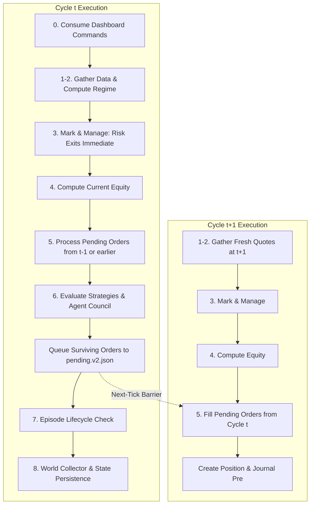

# Technical Implementation Audit: FabInvests Trading Engine (v2)

**Audit Target:** `team-phoenix2471436/trading-bot`  
**Execution Environment:** Windows / Node.js ESM / Local Flat-File Architecture  
**Audit Date:** 2026-09-09  
**Scope:** Read-Only Source Code, Architecture, Math, Data, and Documentation Integrity Audit  

---

## 1. Exact Implementations and File Paths for the 6 Seed Strategies

All trading strategies are registered, seeded, and dispatched in:
- **File Path:** [`scripts/v2/strategies.mjs`](file:///c:/Users/bisme/OneDrive/Desktop/trading%20bot/scripts/v2/strategies.mjs)
- **Math & Indicators Dependency:** [`scripts/lib.mjs`](file:///c:/Users/bisme/OneDrive/Desktop/trading%20bot/scripts/lib.mjs)

Every strategy starts with status `"candidate"`, $n=0$, $\text{expectancy\_R}=0$, $\text{win\_rate}=0$, $\text{kelly}=0.12$, $\text{confidence}=0.2$.

```
+-------------+------------------+---------------+---------+---------+-----------+----------------------+
| Strategy ID | Setup Tag        | Markets       | BaseLev | StopPct | TargetPct | Warmup / Data Scope  |
+-------------+------------------+---------------+---------+---------+-----------+----------------------+
| tsmom       | momentum         | crypto,us,in  | 12x     | 5.0%    | 10.0%     | >= 30 daily closes   |
| donchian    | breakout         | crypto,us,in  | 12x     | 5.0%    | 8.0%      | >= 25 daily closes   |
| rsi2dip     | mean-reversion   | crypto,us,in  | 10x     | 5.0%    | 6.0%      | >= 210 daily closes  |
| mom_trend   | trend            | crypto,us,in  | 10x     | 5.0%    | 8.0%      | >= 30 daily closes   |
| orb         | orb              | us            | 5x      | 1.6%    | 2.8%      | US session first 30m |
| ibreakout   | breakout-15m     | crypto        | 15x     | 1.5%    | 8.0%      | >= 49 15m bars (12h) |
+-------------+------------------+---------------+---------+---------+-----------+----------------------+
```

### 1.1 `tsmom` (Time-Series Momentum)
- **Implementation:** [`scripts/v2/strategies.mjs:39-49`](file:///c:/Users/bisme/OneDrive/Desktop/trading%20bot/scripts/v2/strategies.mjs#L39-L49)
- **Logic:**
  - Requires `c.length >= 30` daily closes.
  - Return calculation: `r28 = retN(c, 28) = c[c.length - 1] / c[c.length - 1 - 28] - 1` (literal source indexing spans 29 intervals).
  - Trend filter: `s200 = sma(c, 200)` (null permitted if `< 200` bars).
  - **Long Entry:** `r28 > 0.03 && (s200 == null || q.price > s200)` $\to$ `confidence: 0.62`, `reason: "28d trend up"`.
  - **Short Entry:** `r28 < -0.03 && (s200 == null || q.price < s200)` $\to$ `confidence: 0.55`, `reason: "28d trend down"`.
- **Strategy Exit:** [`scripts/v2/strategies.mjs:144-149`](file:///c:/Users/bisme/OneDrive/Desktop/trading%20bot/scripts/v2/strategies.mjs#L144-L149)
  - Long exits when `r28 < 0`; short exits when `r28 > 0` (`"trend-flip"`).

### 1.2 `donchian` (Donchian Breakout)
- **Implementation:** [`scripts/v2/strategies.mjs:51-62`](file:///c:/Users/bisme/OneDrive/Desktop/trading%20bot/scripts/v2/strategies.mjs#L51-L62)
- **Logic:**
  - Requires `c.length >= 25` daily closes.
  - Channel definition: `prior = c.slice(c.length - 21, c.length - 1)` (prior 20 completed daily closes, excluding current close).
  - `hi = Math.max(...prior)`, `lo = Math.min(...prior)`.
  - Trend filter: `s200 = sma(c, 200)`.
  - **Long Entry:** `q.price > hi && (s200 == null || q.price > s200)` $\to$ `confidence: 0.60`, `reason: "20d high breakout"`.
  - **Short Entry:** `q.price < lo && (s200 == null || q.price < s200)` $\to$ `confidence: 0.55`, `reason: "20d low breakdown"`.
- **Strategy Exit:** [`scripts/v2/strategies.mjs:137-143`](file:///c:/Users/bisme/OneDrive/Desktop/trading%20bot/scripts/v2/strategies.mjs#L137-L143)
  - Evaluates prior 10 completed closes (`c.slice(c.length - 11, c.length - 1)`).
  - Long exits if `q.price < lo_10`; short exits if `q.price > hi_10` (`"strategy-exit"`).

### 1.3 `rsi2dip` (Connors RSI-2 Dip)
- **Implementation:** [`scripts/v2/strategies.mjs:64-75`](file:///c:/Users/bisme/OneDrive/Desktop/trading%20bot/scripts/v2/strategies.mjs#L64-L75)
- **Logic:**
  - Requires `c.length >= 210` daily closes (strictly requires full 200-SMA history).
  - Indicators: `r2 = rsi(c, 2)` (Wilder smoothed RSI), `s200 = sma(c, 200)`. If either is null, returns null.
  - **Long Entry:** `r2 < 10 && q.price > s200` $\to$ `confidence: 0.60`, `reason: "RSI2 oversold in uptrend"`.
  - **Short Entry:** `r2 > 90 && q.price < s200` $\to$ `confidence: 0.55`, `reason: "RSI2 overbought in downtrend"`.
- **Strategy Exit:** [`scripts/v2/strategies.mjs:130-136`](file:///c:/Users/bisme/OneDrive/Desktop/trading%20bot/scripts/v2/strategies.mjs#L130-L136)
  - Long exits when `r2 >= 65`; short exits when `r2 <= 35` (`"rsi2-reverted"`).

### 1.4 `mom_trend` (Momentum + Trend)
- **Implementation:** [`scripts/v2/strategies.mjs:77-85`](file:///c:/Users/bisme/OneDrive/Desktop/trading%20bot/scripts/v2/strategies.mjs#L77-L85)
- **Logic:**
  - Requires `c.length >= 30` daily closes.
  - Indicators: `r28 = retN(c, 28)`, `s200 = sma(c, 200)`, `q.mom` (10-bar % momentum: `100 * (c_t / c_{t-10} - 1)`), `q.rsi` (14-bar Wilder RSI).
  - **Long Entry:** `(s200 == null || q.price > s200) && r28 > 0.05 && q.mom > 1 && q.rsi < 78` $\to$ `confidence: 0.55`, `reason: "strong 28d momentum above trend"`.
  - **Short Entry:** Explicitly none (`return null`). Long-only strategy.
- **Strategy Exit:** [`scripts/v2/strategies.mjs:144-149`](file:///c:/Users/bisme/OneDrive/Desktop/trading%20bot/scripts/v2/strategies.mjs#L144-L149)
  - Long exits when `r28 < 0` (`"trend-flip"`), or through engine trailing stops.

### 1.5 `orb` (Opening-Range Breakout)
- **Implementation:** [`scripts/v2/strategies.mjs:89-109`](file:///c:/Users/bisme/OneDrive/Desktop/trading%20bot/scripts/v2/strategies.mjs#L89-L109)
- **Logic:**
  - Markets: US equities only (`AAPL`, `NVDA`, `MSFT`, `TSLA`, `AMZN`). Live session tracking via in-memory `cache.orb[symbol]`.
  - Session validation: `q.sessionStart` (regular market open in epoch ms).
  - Eligibility check: First observation must occur within 5 minutes of opening (`sinceOpen >= 0 && sinceOpen <= 5 * 60000`). If observed $>5$ minutes late, `eligible = false`, invalidating the session for that symbol.
  - Range formation: During the first 30 minutes (`sinceOpen <= 30 * 60000`), tracks running `orHi = Math.max(orHi, q.price)` and `orLo = Math.min(orLo, q.price)`. Emits no orders (`return null`).
  - **Long Breakout:** After 30m (`o.formed = true`), if `q.price > o.orHi` $\to$ `confidence: 0.55`, `reason: "ORB break up"`.
  - **Short Breakout:** After 30m (`o.formed = true`), if `q.price < o.orLo` $\to$ `confidence: 0.50`, `reason: "ORB break down"`.
- **Strategy Exit:** No indicator exit. Relies entirely on engine risk exits (1.6% stop, 2.8% target, 4h time-stop, trailing stop).

### 1.6 `ibreakout` (Intraday 15m Breakout)
- **Implementation:** [`scripts/v2/strategies.mjs:112-121`](file:///c:/Users/bisme/OneDrive/Desktop/trading%20bot/scripts/v2/strategies.mjs#L112-L121)
- **Logic:**
  - Markets: Crypto only.
  - Warmup: `q.closesIntraday.length >= 49` (15-minute bars from Yahoo `5d/15m` history).
  - Channel: Prior 48 completed 15m bars (`c.slice(c.length - 49, c.length - 1)`), representing a ~12-hour rolling window.
  - `hi = Math.max(...prior)`, `lo = Math.min(...prior)`.
  - Evaluation: `last = c[c.length - 1]`.
  - **Long Breakout:** `last > hi` $\to$ `confidence: 0.50`, `reason: "15m breakout of 48-bar high"`.
  - **Short Breakout:** `last < lo` $\to$ `confidence: 0.50`, `reason: "15m breakout of 48-bar low"`.
- **Strategy Exit:** No indicator exit. Relies on tight 1.5% stop, 8.0% target, or engine time/trailing stops.

---

## 2. Exact Execution Lifecycle

The execution lifecycle runs sequentially inside `cycle(cfg)` in [`scripts/v2/engine.mjs:281-378`](file:///c:/Users/bisme/OneDrive/Desktop/trading%20bot/scripts/v2/engine.mjs#L281-L378):



### Complete Lifecycle Stages:
1. **Signal Generation:**
   - In Step 6 of Cycle $t$, `runStrategies(state, eq, cfg, histCache)` evaluates watchlist symbols against all non-retired strategies.
   - For candidate symbols, strategies are scored: $\text{score} = \text{sig.confidence} \times (0.5 + \text{strategy.confidence})$.
   - The top strategy per symbol emits an order intent with initial parameters, base leverage, and a cryptographically unique `trade_id` (`t_${t}_${sha256(symbol + seed.id + t)}`).
2. **Deliberation & Approval (Order):**
   - Intended orders pass to `agentCouncil` in [`scripts/v2/agents.mjs`](file:///c:/Users/bisme/OneDrive/Desktop/trading%20bot/scripts/v2/agents.mjs).
   - Three rule-based agents evaluate each intent:
     - **Analyst:** Vetoes longs during downtrend regimes (`crypto_down`, `crypto_down_highvol`, `us_down`); adjusts confidence for Extreme Fear/Greed or elevated funding.
     - **Risk:** Vetoes if total positions $\ge 10$, if same-side crypto cluster $\ge 4$, or if account drawdown $> 10\%$.
     - **Investor:** Vetoes if quote is stale, missing, or wallet balance $< \$2$.
   - Deliberations are logged to `data/agents.v2.jsonl`. Approved orders survive.
3. **Pending Queue:**
   - Approved orders are assigned `createdAt: t` and appended to `data/pending.v2.json`.
   - **No fills occur in Step 6.** The orders remain serialized in `pending.v2.json` until a future cycle.
4. **Fill Execution:**
   - At Step 5 of Cycle $t+1$, the engine reads `data/pending.v2.json`.
   - Fresh quote gate: If quote is missing, `ok === false`, stale (`> 5 min` old), or `t <= order.createdAt`, the order remains in `remaining` queue.
   - Position capacity check: If `positions.length >= 10`, order remains in queue. If symbol is already open, intent is dropped.
   - Sizing: `sizeOrder(state, o, eq, cfg, histCache)` sizes the margin using fresh $t+1$ equity, volatility, Kelly, and goal progress.
   - Entry Execution: `executeOpen(state, cfg, sized, q, t)` computes adverse fill price:
     $$\text{entry} = \text{ref} \times (1 + \text{sideSign} \times (\text{halfSpread} + \text{slip}))$$
   - Enforces taker fee affordability: $\text{margin} + \text{takerFee} \le \text{walletBalance}$.
   - Enforces minimum notional: $\text{notional} \ge \$2$.
   - Deducts $\text{margin} + \text{takerFee}$ from `walletBalance`.
   - Appends open fill to `data/trades.v2.jsonl` and pre-trade record to `data/journal.v2.jsonl`.
5. **Position Tracking:**
   - Position stored in `state.positions[symbol]` with isolated margin, entry price, leverage, MMR, liquidation price, bankruptcy price, and opening metadata.
   - Step 3 of every subsequent cycle updates `pos.mark` via EMA smoothing ($\alpha = 0.25$), accrues crypto funding at UTC boundaries, and tracks `peakUPnl`.
6. **Exit Execution:**
   - Evaluated in Step 3 in strict order:
     $$\text{Liquidation} \longrightarrow \text{Stop-Loss} \longrightarrow \text{Take-Profit} \longrightarrow \text{Time-Stop (4h)} \longrightarrow \text{Trailing Stop}$$
   - (Or queued by `runStrategies` via indicator reversals: `"trend-flip"`, `"rsi2-reverted"`, `"strategy-exit"`).
   - In `closePosition`: Adverse fill price is calculated (`xPrice = fillPrice(mark, exitAction, halfSpread, slip)`).
   - Exit taker fee is deducted: $\text{exitFee} = \text{notional} \times 0.0005$.
   - Gross P&L is settled: $\text{gross} = (\text{xPrice} - \text{entryPrice}) \times \text{qty} \times \text{sideSign}$.
   - Capital returned to wallet: $\text{walletBalance} += \text{isolatedMargin} + \text{gross} - \text{exitFee}$.
7. **Journaling & Learning:**
   - Appends close event to `data/trades.v2.jsonl`.
   - Appends post-trade record to `data/journal.v2.jsonl` with `net_pnl`, `realized_R`, `roi_on_margin`, and `hold_secs`.
   - Invokes `onClose(state, pos, reason)` to increment learning importance counter.
   - Triggers `scoreStrategies` if any close occurred.

---

## 3. Execution Timing: Tick $t$ vs Tick $t+1$ Confirmation

> [!IMPORTANT]
> **CONFIRMED: Entries generated at tick $t$ strictly fill at tick $t+1$ (or later).**
> Under no circumstances can a strategy entry generated at cycle $t$ fill at cycle $t$.

### Proof from Code Architecture:
1. **Structural Step Inversion:**
   - Step 5 (Order Fill Processing) executes at lines [302-320](file:///c:/Users/bisme/OneDrive/Desktop/trading%20bot/scripts/v2/engine.mjs#L302-L320).
   - Step 6 (Signal Evaluation & Agent Council) executes at lines [323-337](file:///c:/Users/bisme/OneDrive/Desktop/trading%20bot/scripts/v2/engine.mjs#L323-L337).
   - Because Step 5 precedes Step 6 in code execution, newly generated orders in Step 6 are written to `pending.v2.json` only after Step 5 has already completed for that cycle.
2. **Explicit Timestamp Invariant Check:**
   - Step 6 timestamps orders at queue time: `createdAt: t` ([`strategies.mjs:209`](file:///c:/Users/bisme/OneDrive/Desktop/trading%20bot/scripts/v2/strategies.mjs#L209)).
   - Step 5 explicitly gates pending fills with:
     ```javascript
     if (!q || !q.ok || q.stale || (o.createdAt && t <= o.createdAt)) {
       remaining.push(o);
       continue;
     }
     ```
     ([`engine.mjs:307`](file:///c:/Users/bisme/OneDrive/Desktop/trading%20bot/scripts/v2/engine.mjs#L307)).
   - Even if the pending loop were somehow re-run within cycle $t$, `t <= o.createdAt` evaluates to `true`, preventing fill execution.
3. **Execution Price Guarantee:**
   - Fill execution at Step 5 of cycle $t+1$ draws a brand new observation $q_{t+1}$ collected at the beginning of cycle $t+1$. Sizing and adverse fill price are calculated on the subsequent cycle's market price.

---

## 4. Exact Implementation of Risk, Sizing, and Perpetual Mechanics

### 4.1 Leverage
- **Configuration:** [`config.json:64-68`](file:///c:/Users/bisme/OneDrive/Desktop/trading%20bot/config.json#L64-L68)
  - `crypto.maxLeverage = 40`, `us.maxLeverage = 4`, `india.maxLeverage = 5`.
  - Aggression limits: `leverageStart = 20`, `leverageCeiling = 40`, `earnItUnlockStep = 3.5`.
- **Enforcement:**
  - Proposed order leverage is clamped in `sizeOrder` ([`sizing.mjs:25`](file:///c:/Users/bisme/OneDrive/Desktop/trading%20bot/scripts/v2/sizing.mjs#L25)):
    $$\text{lev} = \text{clamp}(\text{proposed}, 1, \min(\text{state.aggression.leverageCap}, \text{state.aggression.leverageCeiling}, \text{marketMax}))$$
  - Example: US equity strategy `orb` proposes 5x, but is strictly clamped to market max 4x.
  - Survival Mode override ([`controls.mjs:92`](file:///c:/Users/bisme/OneDrive/Desktop/trading%20bot/scripts/v2/controls.mjs#L92)): If Survival Mode is enabled and equity $\ge$ start equity, leverage is hard-capped at 5x (`SURVIVAL_MAX_LEV = 5`).

### 4.2 Position Sizing
- **Implementation:** [`scripts/v2/sizing.mjs:17-59`](file:///c:/Users/bisme/OneDrive/Desktop/trading%20bot/scripts/v2/sizing.mjs#L17-L59) (`sizeOrder`)
- **Calculation Sequence:**
  1. If `o.marginUsd != null` (explicit margin bypass), skips base sizing and jumps to final wallet clamp.
  2. Base fraction calculation:
     - Account Kelly multiplier:
       $$\text{acctMult} = \text{clamp}\left(\frac{\text{state.aggression.kellyFraction}}{\text{cfg.v2.aggression.kellyFractionStart}}, 0.4, 1.6\right)$$
     - Strategy base fraction:
       $$\text{base} = \text{clamp}((\text{strategy.kelly} \mathbin{??} 0.1) \times \text{acctMult}, 0.02, 0.40)$$
  3. Raw margin: $\text{margin} = \text{base} \times \text{state.equity}$.
  4. Volatility Scaling Multiplier:
     - Daily target volatility: $\text{targetDaily} = \frac{\text{volTargetAnnual}}{\sqrt{365}} = \frac{0.60}{\sqrt{365}} \approx 0.031405$.
     - Observed volatility: $\text{observed} = \text{dailyVol}(\text{closes})$ over prior 15 daily closes (14 log returns, population variance, clamped to $[0.005, 0.15]$; fallback $0.03$ if $<15$ closes).
     - Margin multiplier: $\text{margin} \mathrel{*}= \text{clamp}\left(\frac{\text{targetDaily}}{\text{observed}}, 0.25, 1.7\right)$.
  5. Goal Progress Multiplier:
     - If $\text{goal.target} > \text{goal.startEquity}$, computes progress fraction:
       $$\text{progress} = \frac{\text{equity} - \text{startEquity}}{\text{target} - \text{startEquity}}$$
     - If $0 < \text{progress} < 1$:
       $$\text{margin} \mathrel{*}= 1 + \text{clamp}(0.55 \times (1 - \text{progress}), 0, 0.55)$$
     - If underwater ($\text{equity} \le \text{startEquity}$) or goal met ($\text{progress} \ge 1$), bonus is 0.
  6. Final Cash Availability Clamp:
     $$\text{margin} = \text{clamp}(\text{margin}, 0, \max(0, \text{state.walletBalance} \times 0.98))$$
  7. Fill-time Affordability Gate ([`engine.mjs:143-144`](file:///c:/Users/bisme/OneDrive/Desktop/trading%20bot/scripts/v2/engine.mjs#L143-L144)):
     - Checks $\text{margin} + \text{entryFee} \le \text{walletBalance}$; rejects order if unaffordable.
     - Checks $\text{notional} \ge \text{minNotionalUsd} (\$2)$; rejects order if below minimum.

### 4.3 Stop Loss
- Strategy parameters: 5.0% (`tsmom`, `donchian`, `rsi2dip`, `mom_trend`), 1.6% (`orb`), 1.5% (`ibreakout`).
- Formula ([`engine.mjs:193`](file:///c:/Users/bisme/OneDrive/Desktop/trading%20bot/scripts/v2/engine.mjs#L193)):
  $$\text{stop} = \text{entryPrice} \times (1 - \text{sideSign} \times \text{stopPct})$$
- Triggered in `markAndManage`: long if $\text{mark} \le \text{stop}$; short if $\text{mark} \ge \text{stop}$.
- Exit reason: `"stop-loss"`.
- *Note:* Stop loss is defined as an underlying price distance, NOT an account equity loss percentage. At 20x leverage, a 5% adverse move represents a 100% loss of isolated margin.

### 4.4 Take Profit
- Strategy parameters: 10.0% (`tsmom`), 8.0% (`donchian`, `mom_trend`, `ibreakout`), 6.0% (`rsi2dip`), 2.8% (`orb`).
- Formula ([`engine.mjs:200`](file:///c:/Users/bisme/OneDrive/Desktop/trading%20bot/scripts/v2/engine.mjs#L200)):
  $$\text{tgt} = \text{entryPrice} \times (1 + \text{sideSign} \times \text{targetPct})$$
- Triggered in `markAndManage`: long if $\text{mark} \ge \text{tgt}$; short if $\text{mark} \le \text{tgt}$.
- Exit reason: `"take-profit"`.

### 4.5 Trailing Stop
- Configuration: `trailActivateRoi = 0.5` (50% ROI on margin), `trailGiveRoi = 0.25` (25 ROI percentage points giveback).
- Implementation ([`engine.mjs:212-217`](file:///c:/Users/bisme/OneDrive/Desktop/trading%20bot/scripts/v2/engine.mjs#L212-L217)):
  - Tracks running peak unrealized P&L: `pos.peakUPnl = Math.max(pos.peakUPnl, mk.uPnl)`.
  - Computes peak ROI and current ROI:
    $$\text{peakRoi} = \frac{\text{pos.peakUPnl}}{\text{pos.isolatedMargin}}, \quad \text{curRoi} = \frac{\text{mk.uPnl}}{\text{pos.isolatedMargin}}$$
  - Trigger condition: $\text{peakRoi} \ge 0.50 \text{ and } (\text{peakRoi} - \text{curRoi}) \ge 0.25$.
  - Exit reason: `"trailing-stop"`.

### 4.6 Liquidation
- Formulas ([`scripts/v2/perp.mjs:21-35`](file:///c:/Users/bisme/OneDrive/Desktop/trading%20bot/scripts/v2/perp.mjs#L21-L35)):
  - Maintenance Margin Rate ($\text{mmr}$) determined by tier lookup ([`perp.mjs:8-16`](file:///c:/Users/bisme/OneDrive/Desktop/trading%20bot/scripts/v2/perp.mjs#L8-L16)):
    - Crypto Tier 1 ($0 \text{ to } \$50\text{k}$): $\text{mmr} = 0.004$ (0.4%).
    - US Equities: $\text{mmr} = 0.12$ (12.0%).
    - Indian Equities: $\text{mmr} = 0.10$ (10.0%).
  - Liquidation Price:
    $$\text{liqPrice} = E \times \left(1 - \frac{s}{L} + s \times \text{mmr}\right)$$
    *(Golden verification: Long 5x with $E=100000, \text{mmr}=0.004 \to 80400$; Short 5x $\to 119600$; Long 25x $\to 96400$).*
  - Bankruptcy Price:
    $$\text{bankruptcyPrice} = E \times \left(1 - \frac{s}{L}\right)$$
  - Evaluated first in `markAndManage` before stop-loss:
    $$\text{isLiquidated} = (\text{side} == \text{"short"} \mathrel{?} \text{mark} \ge \text{liqPrice} : \text{mark} \le \text{liqPrice})$$
  - Exit reason: `"liquidation"`.

### 4.7 Fees
- Configuration: `v2.perpFees: { taker: 0.0005, maker: 0.0002 }`.
- Implementation ([`perp.mjs:48`](file:///c:/Users/bisme/OneDrive/Desktop/trading%20bot/scripts/v2/perp.mjs#L48)): $\text{tradeFee}(N, \text{rate}) = |N| \times \text{rate}$.
- Charged on Entry: $\text{fee} = \text{notional} \times 0.0005$ deducted from `walletBalance`.
- Charged on Exit: $\text{exitFee} = \text{closingNotional} \times 0.0005$ deducted from `walletBalance` and `net_pnl`.

### 4.8 Slippage & Spread
- Configuration: `slippage: { crypto: 0.0010, us: 0.0005, india: 0.0005 }`.
- Half-Spread: $h = \frac{\text{cfg.slippage}[market]}{2}$ (e.g. 5 bps for crypto).
- Square-root Impact Slippage ([`perp.mjs:65-67`](file:///c:/Users/bisme/OneDrive/Desktop/trading%20bot/scripts/v2/perp.mjs#L65-L67)):
  $$\text{slip} = k \times \max(0.0005, v) \times \sqrt{\frac{\max(0, N)}{\max(1, D)}}$$
  where $k = 0.6$, $D = \$2,000,000$ (assumed market depth), $N$ is notional, and $v = \text{cfg.slippage}[market]$.
- Execution Fill Price ([`perp.mjs:70-72`](file:///c:/Users/bisme/OneDrive/Desktop/trading%20bot/scripts/v2/perp.mjs#L70-L72)):
  $$\text{fillPrice}(\text{ref}, \text{action}, h, \text{slip}) = \text{ref} \times (1 + \text{sideSign}(\text{action}) \times (h + \text{slip}))$$
  *(Buy orders execute upwards; sell orders execute downwards).*

### 4.9 Funding
- Rate Collection: In `collectWorld` ([`scripts/v2/world.mjs:133-141`](file:///c:/Users/bisme/OneDrive/Desktop/trading%20bot/scripts/v2/world.mjs#L133-L141)), the 8h funding rates of BTC, ETH, and SOL from Hyperliquid are averaged into `state.fundingRate`.
- Accrual Timing: `crossedFundingTimestamps(lastTs, nowTs, [0, 8, 16])` ([`perp.mjs:52-63`](file:///c:/Users/bisme/OneDrive/Desktop/trading%20bot/scripts/v2/perp.mjs#L52-L63)) walks hourly across UTC boundaries.
- Payment Formula ([`perp.mjs:49`](file:///c:/Users/bisme/OneDrive/Desktop/trading%20bot/scripts/v2/perp.mjs#L49)):
  $$\text{fundingPayment}(N, \text{rate}, \text{side}) = -s \times |N| \times \text{rate}$$
  *(Positive rate: long pays, short receives; negative rate: long receives, short pays).*
- Applied directly to `pos.fundingAccrued` and posted to `state.walletBalance`.

### 4.10 Borrow
- Configuration: `v2.leverage.us.borrowAnnual: 0.08` (8% annual borrow cost for US margin).
- **CRITICAL IMPLEMENTATION FINDING:** **Borrow cost is completely unexecuted.** There is zero code in `engine.mjs` or `perp.mjs` calculating, accruing, or charging borrow fees on US equity positions.

### 4.11 Cooldown
- Implementation: [`strategies.mjs:159, 178, 211`](file:///c:/Users/bisme/OneDrive/Desktop/trading%20bot/scripts/v2/strategies.mjs#L159-L211)
- Symbol cooldown duration: **120,000 ms (2 minutes)**.
- Gated: `if (cooldowns[symbol] && t - cooldowns[symbol] < 120000) continue;`.
- Set at the moment an order intent is queued (`cooldowns[symbol] = t`).
- *Limitation:* Stored only in `histCache.cooldowns` in memory; resets on engine process restart.

### 4.12 Position Limits
- Max Concurrent Positions: Configured as `10` ([`config.json:84`](file:///c:/Users/bisme/OneDrive/Desktop/trading%20bot/config.json#L84)).
  - Enforced in `runStrategies` ([`strategies.mjs:175`](file:///c:/Users/bisme/OneDrive/Desktop/trading%20bot/scripts/v2/strategies.mjs#L175)).
  - Enforced in `agentCouncil` Risk Agent ([`agents.mjs:63`](file:///c:/Users/bisme/OneDrive/Desktop/trading%20bot/scripts/v2/agents.mjs#L63)).
  - Enforced at pending order execution ([`engine.mjs:315`](file:///c:/Users/bisme/OneDrive/Desktop/trading%20bot/scripts/v2/engine.mjs#L315)).
- Correlated Cluster Cap: Enforced in Risk Agent ([`agents.mjs:69-74`](file:///c:/Users/bisme/OneDrive/Desktop/trading%20bot/scripts/v2/agents.mjs#L69-L74)): maximum 4 open positions on the same side in crypto.
- Symbol Limit: Strictly 1 position per symbol (`if (state.positions[symbol]) continue;`).

---

## 5. Market-Data Sources, Feed Refresh, Timestamping, Stale Handling & Fallback

```
+----------------+--------------------------+---------------------+-------------------+---------------------------------------------+
| Data Feed      | Provider / Endpoint      | Timeframe / Horizon | Refresh Frequency | Fallback / Stale Handling                   |
+----------------+--------------------------+---------------------+-------------------+---------------------------------------------+
| Spot Quotes    | Yahoo Chart v8 (JSON)    | 1d / 1m             | Every cycle (30s) | Crypto: Coinbase spot; Others: last-good 5m |
| Daily History  | Yahoo Chart v8 (JSON)    | 1y / 1d             | Every 20 minutes  | In-memory retention of prior bars           |
| Crypto 15m     | Yahoo Chart v8 (JSON)    | 5d / 15m            | Every 10 minutes  | In-memory retention of prior bars           |
| FX Rate        | Yahoo `USDINR=X`         | Realtime quote      | Every cycle (30s) | Hardcoded static fallback rate 83.0         |
| Hyperliquid    | POST api.hyperliquid.xyz | 8h funding, mark, OI| 10m TTL cache     | Last-good cached; fundingRate=null if dead  |
| Crypto F&G     | api.alternative.me       | Daily score         | 30m TTL cache     | Last-good cached; marked _stale: true       |
| Stock F&G      | production.dataviz.cnn   | Daily score         | 30m TTL cache     | Last-good cached; marked _stale: true       |
| Put/Call Ratio | cdn.cboe.com (CSV)       | Daily total         | 30m TTL cache     | Hard expiry if date > 6 days old -> null    |
| Stocktwits     | api.stocktwits.com       | Social stream       | 20m TTL cache     | Per-symbol failure tolerated -> null        |
| Fed RSS        | federalreserve.gov       | Press titles        | 60m TTL cache     | Last-good cached; marked _stale: true       |
| Crypto News    | Cointelegraph & Decrypt  | RSS titles          | 30m TTL cache     | Feed failure tolerated; lexicon scoring     |
+----------------+--------------------------+---------------------+-------------------+---------------------------------------------+
```

### 5.1 Symbols & Universes
- **Watchlist (14 symbols):**
  - Crypto: `BTC-USD`, `ETH-USD`, `SOL-USD`, `XRP-USD`, `DOGE-USD`
  - US Equities: `AAPL`, `NVDA`, `MSFT`, `TSLA`, `AMZN`
  - Indian Equities: `RELIANCE.NS`, `TCS.NS`, `INFY.NS`, `HDFCBANK.NS`
- **Indices (4 symbols):** `BTC-USD`, `ETH-USD`, `^GSPC` (S&P 500), `^NSEI` (NIFTY 50)
- **Macro Basket (5 symbols):** `^TNX` (10-Yr Yield), `^VIX` (Volatility), `DX-Y.NYB` (US Dollar Index), `CL=F` (Crude Oil), `GC=F` (Gold)

### 5.2 Network Transport & Timeout
- All outbound requests use Node native `fetch` wrapped with an `AbortController` set to **12,000 ms (12 seconds)** ([`scripts/lib.mjs:84-98`](file:///c:/Users/bisme/OneDrive/Desktop/trading%20bot/scripts/lib.mjs#L84-L98)).
- Standard Desktop Chrome User-Agent header is set to bypass simple anti-bot blocks.

### 5.3 Timestamp & Stale-Data Handling
- System timestamps use Unix epoch milliseconds via `Date.now()`.
- **Stale Threshold:** `STALE_MS = 5 * 60000` (5 minutes) ([`engine.mjs:23`](file:///c:/Users/bisme/OneDrive/Desktop/trading%20bot/scripts/v2/engine.mjs#L23)).
- In `gatherData`: If a quote fetch fails, but previous quote exists in `prices.v2.json` and $(t - \text{prev.ts}) < 5\text{ min}$, quote is kept and flagged: `q = { ...prev[s], stale: true }`.
- If older than 5 minutes, `q = { symbol, ok: false }`.
- **Strict Stale Execution Penalties:**
  - `runStrategies` ignores stale/failed quotes: `if (!q || !q.ok || q.stale) continue;`.
  - Pending fills are held in queue: `if (!q || !q.ok || q.stale) { remaining.push(o); continue; }`.
  - Position marking and exit checking are bypassed: `if (q.stale) continue;` (avoids false stop/liquidation triggers on stale data).
  - Investor agent vetoes trade if quote is stale or not ok.

### 5.4 Fallback Behavior
- **Coinbase Spot Fallback:** If Yahoo fails for `*-USD` crypto symbols, `fetchQuote` queries `https://api.coinbase.com/v2/prices/${pair}-USD/spot`. If successful, returns `{ symbol, price, currency: "USD", ok: true, fallback: "coinbase" }`.
- **USD/INR FX Fallback:** If `USDINR=X` fails or returns non-positive price, `fetchFx` falls back to `83.0` with `{ rate: 83.0, live: false, note: "source fallback 83.0" }`.
- **World Context Fallback:** Missing world data defaults to `null` or `_stale: true` (never invents fake readings).

---

## 6. The $100 / 24h Episode Lifecycle and Capital Reset vs Learning Retention

### 6.1 Lifecycle State Machine
- Starting Capital: $\mathbf{\$100.00}$ (`cfg.v2.startingCapital`).
- Profit Goal Target: $\mathbf{\$500.00}$ (`cfg.v2.episode.goal.target`).
- Episode Duration: $\mathbf{24\text{ hours}}$ (`cfg.v2.episode.maxHoursPerEpisode`), or overridden by `state.episodeMaxHours`.
- Termination Precedence ([`scripts/v2/episode.mjs:63-70`](file:///c:/Users/bisme/OneDrive/Desktop/trading%20bot/scripts/v2/episode.mjs#L63-L70)):
  1. `blowup`: $\text{equity} \le 0$
  2. `goal`: $\text{equity} \ge 500$
  3. `time`: $\text{nowTs} - \text{startedAt} \ge \text{maxHours} \times 3600000$
  4. (Manual restart command from dashboard).

### 6.2 Settlement & Transition Routine
When an episode ends:
1. All surviving open positions are closed at mark with exit reason `"episode-end"`.
2. Final equity is calculated and equity peak is recorded.
3. `finalizeEpisode` records duration, return percent, drawdown, and appends a record to `data/episodes.jsonl`.
4. `onEpisodeEnd` scores strategies, extracts memory lessons, adjusts the account aggression dial, increments generation, and logs to `generations.jsonl` and `reflog.v2.jsonl`.
5. `nextEpisode` resets operational capital and begins the next run.

### 6.3 Exact Capital Reset vs Learning Retention Matrix

```
+------------------------------------------------+------------------------------------------------------+
| RESET TO CLEAN BASELINE (Per-Run Variables)   | PRESERVED ACROSS EPISODES (Persistent Learning)      |
+------------------------------------------------+------------------------------------------------------+
| startingCapital: reset to $100                 | generation: preserved (incremented by onEpisodeEnd)   |
| walletBalance: reset to $100                   | aggression.kellyFraction: preserved                  |
| equity: reset to $100                          | aggression.leverageCap & unlockedLevel: preserved    |
| peakEquity: reset to $100                      | lifetime career stats (episodes, blowups, bests)     |
| maxDrawdownPct: reset to 0                     | strategies.json: all n, win_rate, expectancy, kelly  |
| realizedPnlEpisode: reset to 0                 | memory.jsonl: all distilled lessons & win/loss text  |
| positions: reset to {}                         | journal.v2.jsonl & trades.v2.jsonl: full trade logs  |
| riskState: reset to "normal"                   | episodes.jsonl: chronological history of all runs    |
| blownUp: reset to false                        | reflog.v2.jsonl: sha256 hash-chained audit trail     |
| goal: startEquity reset to $100                | generations.jsonl: evolution history log             |
| pending.v2.json: cleared to { orders: [] }     |                                                      |
+------------------------------------------------+------------------------------------------------------+
```

---

## 7. Evolution Mechanics: Strategy Statistics, Kelly, Confidence, Memory, Status & Generation

### 7.1 Strategy Statistics Calculation
Calculated in `scoreStrategies(state, cfg)` ([`scripts/v2/brain.mjs:153-206`](file:///c:/Users/bisme/OneDrive/Desktop/trading%20bot/scripts/v2/brain.mjs#L153-L206)) across all historical closed trades joined from `journal.v2.jsonl`:
- **Realized R:** $R = \frac{\text{net\_pnl}}{\text{initialRisk}}$, where $\text{initialRisk} = |\text{qty} \times \text{entryPrice} \times \text{stopPct}| \mathbin{??} \text{isolatedMargin}$.
- **Win Rate:** $\text{wins} / n$ (trades with $R > 0$).
- **Expectancy R:** Mean of realized $R$ across all completed trades.
- **Profit Factor:** $\frac{\sum(R > 0)}{\sum(|R < 0|)}$.
- **SQN (System Quality Number):** $\sqrt{n} \times \frac{\text{expectancyR}}{\text{sampleStdev}(R)}$.
- **Wilson Lower Bound:** 95% confidence lower bound of binomial win rate ($z=1.96$).
- **Breakeven Win Rate:** $\frac{\text{avgLossR}}{\text{avgWinR} + \text{avgLossR}}$.
- **Deflated Sharpe Ratio (DSR):** Exact Bailey/López de Prado formulation ([`brain.mjs:63-79`](file:///c:/Users/bisme/OneDrive/Desktop/trading%20bot/scripts/v2/brain.mjs#L63-L79)) testing against expected maximum Sharpe over $N=6$ trials with population skewness and Pearson kurtosis. Returns `pass = true` only if unrounded $DSR > 0.95$ and $n \ge 8$.

### 7.2 Strategy Kelly
Calculated in `strategyKelly(s)` ([`brain.mjs:136-150`](file:///c:/Users/bisme/OneDrive/Desktop/trading%20bot/scripts/v2/brain.mjs#L136-L150)):
- If $n < 5$: $k = 0.12$ (or $0.04$ if backtest failed).
- If $n \ge 5$:
  $$k = 0.4 \times \text{clamp}\left(\frac{\text{expectancy\_R}}{\text{variance\_R}}, 0, 1.5\right)$$
- If `backtest_kelly` exists: blends live Kelly with prior pseudo-count 15:
  $$k = \frac{n \times k + 15 \times \text{backtest\_kelly}}{n + 15}$$
- If `status === "probation"`: $k \mathrel{/}= 2$.
- If `status === "retired"`: $k = 0.02$.
- Final clamp: $k = \text{clamp}(k, 0.02, 0.40)$.

### 7.3 Strategy Confidence
Updated in `scoreStrategies` ([`brain.mjs:173`](file:///c:/Users/bisme/OneDrive/Desktop/trading%20bot/scripts/v2/brain.mjs#L173)):
$$\text{confidence} = \begin{cases} 0.2, & \text{if } n = 0 \text{ or } \text{wilsonLb is null} \\ \text{clamp}(0.2 + \text{wilsonLb}, 0.05, 0.95), & \text{if } n > 0 \end{cases}$$

### 7.4 Strategy Lifecycle Status Transitions
- `candidate` $\to$ `active`: Requires $n \ge 30$ and:
  $$\text{wilsonLb} > \text{breakevenWr} \land \text{PF} \ge 1.5 \land \text{SQN} \ge 1.5 \land \text{expectancyR} > 0 \land \text{tStat} > 4.25 \land \text{DSR.pass}$$
- `active` $\to$ `probation`: Evaluated on the last 30 trades (`rs.slice(-30)`): demoted if recent $\text{PF} < 1.2$ OR recent $\text{expectancyR} < 0$ OR full $\text{SQN} < 1.0$. Resets `probationFails = 0`.
- `probation` $\to$ `active`: Recovers if recent $\text{PF} \ge 1.5$ AND recent $\text{expectancyR} > 0$.
- `probation` $\to$ `retired`: If probation check fails, `probationFails` increments. If `probationFails >= 3` consecutive failing checks, the strategy is permanently `retired`.

### 7.5 Memory System
- **Creation:** At episode end in `distillEpisodeLessons` ([`brain.mjs:215-260`](file:///c:/Users/bisme/OneDrive/Desktop/trading%20bot/scripts/v2/brain.mjs#L215-L260)):
  - If episode blew up: appends `kind: "blowup"`, `importance: 10`.
  - If no trades: appends `kind: "note"`, `importance: 2`.
  - Otherwise groups trades by `strategy_id / regime`:
    - Worst group (if net PnL $<0$): appends `kind: "loss"`, `importance: 7`.
    - Best group (if net PnL $>0$): appends `kind: "win"`, `importance: 5`.
- **Retrieval:** `retrieveLessons(regime, k = 4)` ([`brain.mjs:275-286`](file:///c:/Users/bisme/OneDrive/Desktop/trading%20bot/scripts/v2/brain.mjs#L275-L286)):
  - Reads last 500 rows from `data/memory.jsonl`.
  - Scores each lesson: $\text{score} = \text{importance} \times 0.95^{\text{ageDays}} \times (\text{regimeMatch} \mathrel{?} 1.0 : 0.4)$.
  - Returns top 4 scoring lessons for the dashboard brain digest.

### 7.6 Generation & Account Aggression Dial
- **Episode-End Transitions (`onEpisodeEnd`):**
  - Computes episode realized edge: $\text{edge} = \text{mean}(\text{closedThisEp.realized\_R})$.
  - If goal reached or timed out in profit, and $\text{edge} > 0$:
    - $\text{unlockedLevel} \mathrel{+}= 1$
    - $\text{kellyFraction} \mathrel{+}= 0.07 \times \text{clamp}(\text{edge}, 0.2, 1.2)$
  - If episode ended in blowup:
    - $\text{unlockedLevel} \mathrel{-}= 1$
    - $\text{kellyFraction} \mathrel{-}= 0.03$
  - $\text{kellyFraction}$ is clamped to $[0.02, 0.70]$.
  - Leverage cap is updated: $\text{leverageCap} = \text{clamp}(20 + \text{unlockedLevel} \times 3.5, 20, 40)$.
  - **Generation increments by 1:** $\text{state.generation} \mathrel{+}= 1$.
  - Record written to `data/generations.jsonl` and `data/reflog.v2.jsonl`.
- **Mid-Episode Evolution (`evolveTick`):**
  - Runs every 8 minutes. Requires $\ge 4$ career trades and fresh trades since `lastEvolveTs`.
  - Evaluates last 25 trades: $\text{edge} = \text{mean}(R)$.
  - If $\text{edge} > 0.05 \land \text{equity} > \text{startEquity} \land \text{drawdown} < 15\%$: $\Delta = +1$.
  - If $\text{edge} < -0.05 \lor \text{drawdown} \ge 18\%$: $\Delta = -1$.
  - If $\Delta \ne 0$: updates $\text{unlockedLevel} \mathrel{+}= \Delta$, $\text{kellyFraction} \mathrel{+}= 0.02 \times \Delta$, recomputes $\text{leverageCap}$. Does *not* increment generation.

---

## 8. Discrepancies Between Codebase Implementation and Project Documentation

Every discrepancy between the implementation and the documentation files is identified below:

1. **Borrow Fees Completely Missing from Execution:**
   - *Documentation:* [`docs/05-configuration.md`](file:///c:/Users/bisme/OneDrive/Desktop/trading%20bot/docs/05-configuration.md) and [`docs/08-trading-math.md:63`](file:///c:/Users/bisme/OneDrive/Desktop/trading%20bot/docs/08-trading-math.md#L63) define US borrow cost (`us.borrowAnnual = 0.08`).
   - *Code Reality:* Borrow fee is never computed, charged, or accrued anywhere in `engine.mjs` or `perp.mjs`.
2. **Net Trade P&L Calculation Omits Entry Fee:**
   - *Documentation:* [`docs/07-trading-engine.md:39`](file:///c:/Users/bisme/OneDrive/Desktop/trading%20bot/docs/07-trading-engine.md#L39) explicitly defines:
     $$\text{Net trade P\&L} = G - F_{\text{open}} - F_{\text{close}} + C - \text{borrow costs}$$
   - *Code Reality:* [`engine.mjs:95`](file:///c:/Users/bisme/OneDrive/Desktop/trading%20bot/scripts/v2/engine.mjs#L95) calculates:
     ```javascript
     const net = gross - exitFee + pos.fundingAccrued;
     ```
     $F_{\text{open}}$ is omitted from `net_pnl` and `realized_R`. As a result, journaled net P&L and realized R for all trades overstate trade performance by the entry fee amount ($0.05\%$ of entry notional).
3. **Manual Restart Drops Open Positions Without Settlement:**
   - *Documentation:* [`docs/07-trading-engine.md:48`](file:///c:/Users/bisme/OneDrive/Desktop/trading%20bot/docs/07-trading-engine.md#L48) states: *"Never erase remaining positions by nextEpisode before settlement."*
   - *Code Reality:* In `controls.mjs` ([`controls.mjs:60-63`](file:///c:/Users/bisme/OneDrive/Desktop/trading%20bot/scripts/v2/controls.mjs#L60-L63)), when handling a restart command, the engine calls `finalizeEpisode(state, "manual-restart")` and `nextEpisode(state, cfg)` without calling `closePosition`. Open positions are wiped out of `state.positions`, leaving orphaned `pre` rows in `journal.v2.jsonl` with no close records in `trades.v2.jsonl`.
4. **Interactive Dashboard Command Channel & Survival Mode are Unspecified Extensions:**
   - *Documentation:* [`docs/00-project-overview.md:11`](file:///c:/Users/bisme/OneDrive/Desktop/trading%20bot/docs/00-project-overview.md#L11) specifies a strictly read-only dashboard.
   - *Code Reality:* [`controls.mjs`](file:///c:/Users/bisme/OneDrive/Desktop/trading%20bot/scripts/v2/controls.mjs) and `POST /api/state` implement an interactive command queue (`setGoal`, `restart`, `setSurvival`) and an aggressive "Survival Mode" that blocks entries when underwater and caps leverage at 5x.
5. **Multi-Agent Decision Council is an Unspecified Extension:**
   - *Documentation:* [`docs/00-project-overview.md:22`](file:///c:/Users/bisme/OneDrive/Desktop/trading%20bot/docs/00-project-overview.md#L22) and [`docs/02-system-architecture.md`](file:///c:/Users/bisme/OneDrive/Desktop/trading%20bot/docs/02-system-architecture.md) describe deterministic mathematical dispatch with zero agents.
   - *Code Reality:* [`scripts/v2/agents.mjs`](file:///c:/Users/bisme/OneDrive/Desktop/trading%20bot/scripts/v2/agents.mjs) implements a 3-agent council (Analyst, Risk, Investor) deliberating over every intent and recording decisions to `agents.v2.jsonl`.
6. **Next-Tick Execution Inverts Literal Step 6:**
   - *Documentation:* [`docs/07-trading-engine.md:14`](file:///c:/Users/bisme/OneDrive/Desktop/trading%20bot/docs/07-trading-engine.md#L14) lists literal step 6 as sizing and executing orders on the same cycle.
   - *Code Reality:* Code implements Decision D01, moving fill execution to step 5 and order queueing to step 6, enforcing strict $t \to t+1$ barrier filling.
7. **Literal `retN` Window Discrepancy:**
   - *Documentation:* [`docs/08-trading-math.md:16`](file:///c:/Users/bisme/OneDrive/Desktop/trading%20bot/docs/08-trading-math.md#L16) notes that literal `retN(c, 28) = c[last] / c[last - 1 - 28] - 1` covers 29 intervals instead of 28.
8. **Asymmetric Leverage Cap Lower Bound:**
   - *Documentation:* [`docs/11-episodes-and-evolution.md:46`](file:///c:/Users/bisme/OneDrive/Desktop/trading%20bot/docs/11-episodes-and-evolution.md#L46) notes that `leverageCap` formula `clamp(20 + level * 3.5, 20, 40)` has a fixed lower bound of 20x. Even after catastrophic drawdowns or negative levels, the leverage cap cannot fall below the starting 20x.
9. **Single Funding Rate Approximation Across Entire Universe:**
   - *Documentation:* [`docs/13-world-model.md:34`](file:///c:/Users/bisme/OneDrive/Desktop/trading%20bot/docs/13-world-model.md#L34) notes that averaging Hyperliquid BTC/ETH/SOL rates and applying that average to XRP and DOGE is an unverified proxy.
10. **Synthetic Static FX Fallback (83.0):**
    - *Documentation:* [`docs/13-world-model.md:14`](file:///c:/Users/bisme/OneDrive/Desktop/trading%20bot/docs/13-world-model.md#L14) flags the hardcoded fallback rate of 83.0 as conflicting with the "never fabricate data" rule.

---

## 9. Comprehensive Inspection of Previous Runs Data

Empirical data was inspected directly from:
- `data/episodes.jsonl`
- `data/journal.v2.jsonl`
- `data/trades.v2.jsonl`
- `data/strategies.json`
- `data/generations.jsonl`
- `data/memory.jsonl`
- `data/reflog.v2.jsonl`
- `data/state.v2.json`

### 9.1 Overall System Metrics
- **Total Episodes Logged:** 4 completed, 1 currently active (Episode 5).
  - Episode 1: Ended via `manual-restart`. Duration: 5.97h. Final equity: $98.41. Return: -1.59%. Peak: $100.00. Max DD: 1.60%.
  - Episode 2: Ended via `time` (1h cap). Duration: 1.00h. Final equity: $99.89. Return: -0.11%. Peak: $100.045. Max DD: 0.15%.
  - Episode 3: Ended via `time` (1h cap). Duration: 1.01h. Final equity: $99.83. Return: -0.17%. Peak: $100.00. Max DD: 0.19%.
  - Episode 4: Ended via `time` (24h cap). Duration: 23.71h. Final equity: $99.65. Return: -0.35%. Peak: $100.00. Max DD: 0.35%.
  - Episode 5 (Active): Started at `ts: 1788904493127`, cycle 347. Capital: $100, equity: $100, positions: 0.
- **Trade Counts:**
  - Total `pre` journal rows (opens): **25**
  - Total `post` journal rows (closes): **20**
  - Matched, completed trades: **20**
  - Open/forfeited positions without close records: **5** (opened in Episode 1 at `1788809390667` across BTC, ETH, SOL, XRP, DOGE, forfeited upon manual restart).
- **Financial Performance (20 Closed Trades):**
  - Total Gross P&L (executed fill close vs entry): $\mathbf{-\$1.0372\text{ USD}}$
  - Total Realized Net P&L (as journaled): $\mathbf{-\$1.5795\text{ USD}}$
  - Wins: **1** (DOGE-USD in Episode 2: +$0.0154 USD)
  - Losses: **19** (-$1.5949 USD)
  - Win Rate: $\mathbf{5.00\%}$ (1 / 20)
  - Liquidations: $\mathbf{0}$
- **Transaction Costs & Slippage (20 Closed Trades):**
  - Entry Taker Fees: $\mathbf{\$0.5316\text{ USD}}$
  - Exit Taker Fees: $\mathbf{\$0.5313\text{ USD}}$
  - Total Round-Trip Fees: $\mathbf{\$1.0629\text{ USD}}$
  - (Additional Entry Fees on 5 forfeited open trades: $\$0.0724\text{ USD}$; total entry fees across all 25 opens: $\$0.6040\text{ USD}$).
  - Modeled Half-Spread Paid (Entry + Exit): $\mathbf{\$0.9652\text{ USD}}$ (5 bps on each leg).
  - Modeled Square-Root Impact Slippage (Entry + Exit): $\mathbf{\$0.0106\text{ USD}}$ (~0.05 bps).
- **Funding Carry (20 Closed Trades):**
  - Total Funding Accrued/Paid: $\mathbf{-\$0.011009\text{ USD}}$ (net cash outflow paid by long positions).
  - Episode 1: $-\$0.010991\text{ USD}$ (crossed 16:00 UTC boundary on 2026-09-07).
  - Episode 2 & 3: $\$0.000000\text{ USD}$ (no UTC boundaries crossed during 1h duration).
  - Episode 4: $-\$0.000019\text{ USD}$ (crossed 00:00, 08:00, 16:00 UTC boundaries on 2026-09-08).

---

### 9.2 Performance Breakdown by Strategy
```
+-------------+--------+------+--------+----------+-----------------+-----------------+----------------+
| Strategy ID | Trades | Wins | Losses | Win Rate | Net P&L (USD)   | Expectancy R    | Profit Factor  |
+-------------+--------+------+--------+----------+-----------------+-----------------+----------------+
| tsmom       | 20     | 1    | 19     | 5.0%     | -$1.5795        | -0.0501         | 0.0326         |
| donchian    | 0      | 0    | 0      | N/A      | $0.0000         | 0.0000          | 0.0000         |
| rsi2dip     | 0      | 0    | 0      | N/A      | $0.0000         | 0.0000          | 0.0000         |
| mom_trend   | 0      | 0    | 0      | N/A      | $0.0000         | 0.0000          | 0.0000         |
| orb         | 0      | 0    | 0      | N/A      | $0.0000         | 0.0000          | 0.0000         |
| ibreakout   | 0      | 0    | 0      | N/A      | $0.0000         | 0.0000          | 0.0000         |
+-------------+--------+------+--------+----------+-----------------+-----------------+----------------+
```
*(All 20 completed trades were executed exclusively by `tsmom`).*

---

### 9.3 Performance Breakdown by Symbol
```
+-----------+--------+------+--------+----------+-----------------+---------------+
| Symbol    | Trades | Wins | Losses | Win Rate | Net P&L (USD)   | Avg P&L/Trade |
+-----------+--------+------+--------+----------+-----------------+---------------+
| BTC-USD   | 4      | 0    | 4      | 0.0%     | -$0.3467        | -$0.0867      |
| ETH-USD   | 4      | 0    | 4      | 0.0%     | -$0.2358        | -$0.0590      |
| SOL-USD   | 4      | 0    | 4      | 0.0%     | -$0.3716        | -$0.0929      |
| XRP-USD   | 4      | 0    | 4      | 0.0%     | -$0.2543        | -$0.0636      |
| DOGE-USD  | 4      | 1    | 3      | 25.0%    | -$0.3712        | -$0.0928      |
| AAPL      | 0      | 0    | 0      | N/A      | $0.0000         | $0.0000       |
| NVDA      | 0      | 0    | 0      | N/A      | $0.0000         | $0.0000       |
| MSFT      | 0      | 0    | 0      | N/A      | $0.0000         | $0.0000       |
| TSLA      | 0      | 0    | 0      | N/A      | $0.0000         | $0.0000       |
| AMZN      | 0      | 0    | 0      | N/A      | $0.0000         | $0.0000       |
| RELIANCE  | 0      | 0    | 0      | N/A      | $0.0000         | $0.0000       |
| TCS       | 0      | 0    | 0      | N/A      | $0.0000         | $0.0000       |
| INFY      | 0      | 0    | 0      | N/A      | $0.0000         | $0.0000       |
| HDFCBANK  | 0      | 0    | 0      | N/A      | $0.0000         | $0.0000       |
+-----------+--------+------+--------+----------+-----------------+---------------+
```
*(Only crypto symbols traded. US and Indian equities never entered trades because crypto momentum dominated signal scoring and reached position capacity).*

---

### 9.4 Performance Breakdown by Exit Reason
```
+---------------+--------+------+--------+----------+-----------------+---------------+
| Exit Reason   | Trades | Wins | Losses | Win Rate | Net P&L (USD)   | Avg P&L/Trade |
+---------------+--------+------+--------+----------+-----------------+---------------+
| time-stop     | 10     | 0    | 10     | 0.0%     | -$1.3622        | -$0.1362      |
| episode-end   | 10     | 1    | 9      | 10.0%    | -$0.2173        | -$0.0217      |
| liquidation   | 0      | 0    | 0      | N/A      | $0.0000         | $0.0000       |
| stop-loss     | 0      | 0    | 0      | N/A      | $0.0000         | $0.0000       |
| take-profit   | 0      | 0    | 0      | N/A      | $0.0000         | $0.0000       |
| trailing-stop | 0      | 0    | 0      | N/A      | $0.0000         | $0.0000       |
| trend-flip    | 0      | 0    | 0      | N/A      | $0.0000         | $0.0000       |
| strategy-exit | 0      | 0    | 0      | N/A      | $0.0000         | $0.0000       |
+---------------+--------+------+--------+----------+-----------------+---------------+
```
*(All 20 exits occurred due to time limits: either the 4-hour max hold duration or automatic episode termination settlement).*

---

### 9.5 Performance Breakdown by Market Regime
```
+---------------------+--------+------+--------+----------+-----------------+
| Market Regime       | Trades | Wins | Losses | Win Rate | Net P&L (USD)   |
+---------------------+--------+------+--------+----------+-----------------+
| broad_up            | 20     | 1    | 19     | 5.0%     | -$1.5795        |
| crypto_down_highvol | 0      | 0    | 0      | N/A      | $0.0000         |
| crypto_down         | 0      | 0    | 0      | N/A      | $0.0000         |
| us_down             | 0      | 0    | 0      | N/A      | $0.0000         |
| mixed_chop          | 0      | 0    | 0      | N/A      | $0.0000         |
| risk_off            | 0      | 0    | 0      | N/A      | $0.0000         |
+---------------------+--------+------+--------+----------+-----------------+
```
*(100% of all entries occurred under `broad_up`, because BTC was trending upwards above its 20/50 SMAs at the time of order generation).*

---

## 10. Verification of Unknowns and Information Boundaries

To prevent inventing missing information, the following operational and financial unknowns are explicitly flagged:
1. **True Real-World Execution Slippage:** The recorded slippage figures are strictly generated by the synthetic square-root formula with static depth $D=\$2,000,000$. Actual order book depth on perpetual exchanges for altcoins (SOL, XRP, DOGE) during high volatility is unknown.
2. **Missing Borrow Accounting Rationale:** It is unknown why `us.borrowAnnual: 0.08` was configured in `config.json` and documented in `docs/05` and `docs/08`, but omitted from execution in `engine.mjs` and `perp.mjs`.
3. **Intent of Orphaned Positions on Manual Restart:** The documentation does not specify whether manual restart should liquidate open positions at market, forfeit them, or carry them forward. The code silently deletes them from state without recording close fills.
4. **Historical Tick Rates for Funding:** When an engine cycle encounters multiple crossed funding boundaries across missed hours, it applies the current live funding rate retrospectively to all crossed boundaries. Historical funding rates at those exact past UTC timestamps are unknown.
5. **Asset-Specific Funding Rates for Altcoins:** Hyperliquid provides BTC, ETH, and SOL funding. The system averages these three and applies the result to DOGE and XRP. True venue funding rates for DOGE and XRP are unknown.
6. **Execution Venue for Equities:** US and Indian equities are simulated using perpetual-style leverage and liquidation models. Real-world equity borrowing fees, short locates, circuit breakers, and overnight gap behavior are not modeled.
