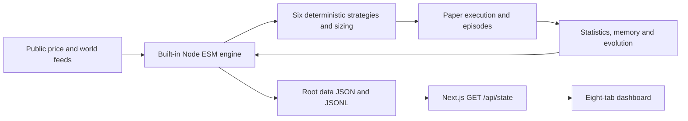

# FabInvests — technical blueprint

A source-derived specification for a deterministic leveraged **paper-trading simulator**, reconstructed from all eleven prompts in [source-article.md](source-article.md). **Status: implemented** — engine, world collectors, learning, API and dashboard now exist per the docs; open source gaps are resolved in [DECISIONS.md](DECISIONS.md) and marked `[DECISION]` in code.

## Run it

```text
node scripts/v2/init.mjs          # one-time init (idempotent; --force resets capital, not learning)
node scripts/v2/engine.mjs        # continuous engine, 30s cycles  (--once for a single cycle)
cd web && npm install && npm run dev -- -p 3002   # dashboard at http://localhost:3002
```

**Real observations, fake money. No guaranteed edge. Never connect this simulator to real-money execution. This is not financial advice.**

## Start here

Read the [master documentation guide](docs/README.md), then [source analysis](docs/01-source-analysis.md), [source architecture](docs/02-system-architecture.md), [source audit](docs/17-source-audit.md), and [separate recommended architecture](docs/19-recommended-architecture.md). Use the [implementation checklist](docs/18-implementation-checklist.md) as the future coding agent's execution tracker.



## What the source builds

A USD100-to-USD500 episode simulator, leveraged long/short positions, modeled costs and mark-based liquidation, persistent strategy statistics and lessons, public-world context, and a sakura-themed dashboard. The engine makes no runtime LLM calls. Claude Code is the author's build assistant, not the trading strategy.

Build order: foundation → data contracts → financial math → episodes/strategies/sizing → memory/world → execution → filesystem API → dashboard → integration/recovery tests.

## Documentation map

The complete [22-file documentation map](docs/README.md#documentation-map) includes configuration, file/data schemas, trading mathematics, all six strategies, risk, episodes, learning, world feeds, UI/API, tests and traceability. Documents 00–15 primarily reconstruct source requirements; explicitly labeled proposals appear alongside gaps. Document 17 audits the source; 19 is recommendations only; 16/18 define testing and execution work; 20 records coverage and verification limits.

## Source and status

Attribution: [FabRich guide](https://fabrichhhhhh.com/free/build-an-ai-trading-bot-with-claude). Primary evidence is the supplied repository copy, not an independently fetched live page. Source requirements and recommendations are labeled separately; undefined source behavior is marked `SOURCE DOES NOT SPECIFY`.

All implementation checkboxes remain unchecked. Financial/runtime tests, live dependency/provider verification and the specialist security assessment are not completed by a documentation-only change. See [quality review](docs/20-source-traceability.md) for the exact boundaries.
