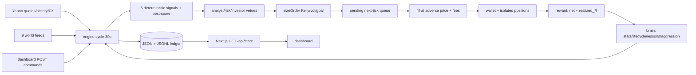
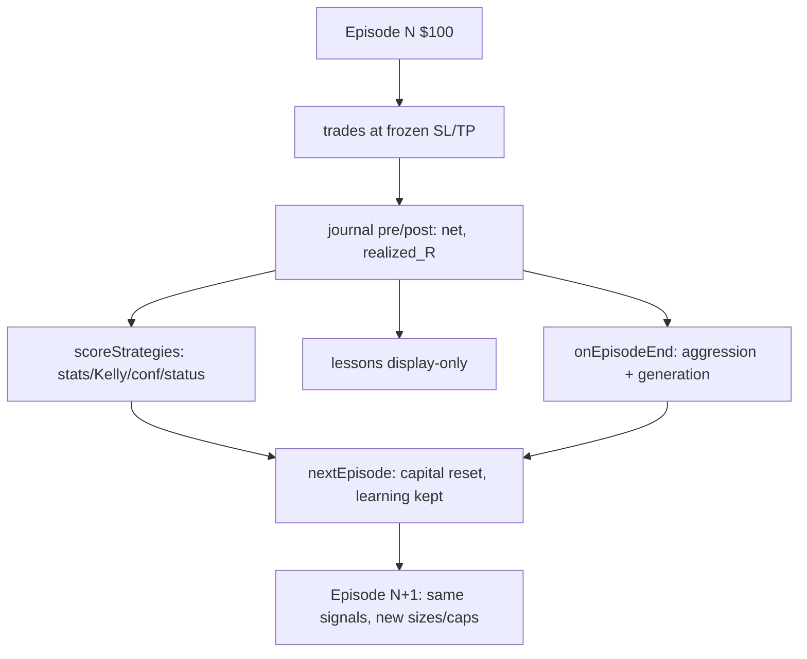

# TRADING AGENT — DEEP TECHNICAL AUDIT (evidence-first, code-traced)

> Date: 2026-09-13 · HEAD `396b59d` (`main`, GitHub-only) · Data dir `data/` live-read 2026-09-09 cycle 947
> Method: read `scripts/v2/*.mjs`, `scripts/lib.mjs`, `scripts/world/score.mjs`, `web/app/api/state/route.ts`, all `tests/*.mjs`, live `data/*.json/jsonl`. Did NOT modify state, did NOT run engine (read-only audit; ran `node --test` + python reads only).
> Legend: **IMPLEMENTED** = verified in code · **PARTIALLY** = code exists but claimed effect incomplete · **DOCUMENTED ONLY** = docs claim, no code path.

---

## 1. Repository structure (what matters, what runs)

| Path | What it does | Runs at runtime? | Key exports / notes |
|---|---|---|---|
| `scripts/v2/engine.mjs` | **The only live loop.** 30 s `cycle()` + `--once`. gather→mark→equity→fill pending→strategies→council→queue→episode lifecycle→brain tick→world→persist→publish | YES — entry point | `cycle(cfg)`, `gatherData`, `markAndManage`, `closePosition`, `executeOpen`, `computeEquity`, `publishSignals`, lock/no-overlap |
| `scripts/v2/strategies.mjs` | 6 deterministic signal fns + dispatch `runStrategies` + `strategyExit` | YES (called every cycle) | `SEEDS[6]`, `sigTsmom/sigDonchian/sigRsi2dip/sigMomTrend/sigOrb/sigBreakoutIntraday`, `SIGNALS`, `runStrategies` |
| `scripts/v2/sizing.mjs` | Deterministic Kelly/vol/goal/wallet sizing `sizeOrder` | YES (on every pending open) | `dailyVol`, `sizeOrder` |
| `scripts/v2/perp.mjs` | Pure perp math, no I/O | YES (imported) | `liqPrice`, `openPosition`, `markPosition`, `fillPrice`, `tradeFee`, `fundingPayment`, `slippageFraction`, `emaUpdate` |
| `scripts/v2/brain.mjs` | Statistics + lifecycle + lessons + aggression evolution | YES (on close / episode-end / 8-min tick) | `scoreStrategies`, `strategyKelly`, `onEpisodeEnd`, `evolveTick`, `loadClosedV2`, `distillEpisodeLessons`, `retrieveLessons`, `buildBrainV2`, `deflatedSharpe` |
| `scripts/v2/episode.mjs` | Episode state machine | YES | `freshV2State`, `recordEquityPeak`, `episodeEndReason`, `finalizeEpisode`, `nextEpisode`, `setGoal` |
| `scripts/v2/agents.mjs` | **OWNER EXTENSION.** 3 rule-based veto agents (no LLM) | YES (every cycle on intents) | `analystDecide`, `riskDecide`, `investorDecide`, `agentCouncil` → `data/agents.v2.jsonl` |
| `scripts/v2/controls.mjs` | **OWNER EXTENSION.** Dashboard command channel + survival mode | YES (cycle step 0) | `consumeCommands`, `survivalGate`, `SURVIVAL_MAX_LEV=5` |
| `scripts/v2/world.mjs` | Keyless world collectors + TTL last-good cache | YES (cycle step 8) | `collectWorld` → `data/world.v2.json`; 9 providers |
| `scripts/world/score.mjs` | Pure world scoring | YES (via world.mjs) | `lexiconScore`, `fngBand`, `regimeScore`, `aggregateNews`, `POS/NEG` weights |
| `scripts/v2/store.mjs` | V2 path registry + `round/clamp` | YES | `V2{state,signals,episodes,generations,strategies,memory,pending,trades,equity,prices,log,journal,playbook,reflog,calib,world,worldThesis,worldCache,commands,agents}` |
| `scripts/lib.mjs` | Shared toolbox: I/O, Yahoo fetch, indicators, stats, regime | YES | `fetchQuote/fetchHistory/fetchFx`, `sma/rsi/momentum/indicators`, `mean/stdev/wilsonLB/sqnOf/profitFactor/expectancyStats`, `regime` |
| `scripts/v2/init.mjs` + `scripts/init.mjs` + `scripts/daemon.mjs` | Init + aliases (D13: no legacy v1 engine exists) | CLI only | `freshV2State` + `ensureStrategies`; idempotent w/o `--force` |
| `web/app/api/state/route.ts` | Filesystem bridge `GET` (read-only) + `POST` command queue | YES (dashboard backend) | `GET→{serverTs,config,v2:{signals,state,episodes,generations,strategies,memory,equity,trades}}`; `POST setGoal/restart/setSurvival` |
| `web/app/components/DashboardV2.tsx` | 8-tab sakura UI, Decision Council + Control Panel cards | UI only | `AgentLog`, `ControlPanel`; states “multimodal rules, no AI” |
| `tests/*.mjs` (6 files, 52 tests) | Unit vectors, all `FAB_DATA`-isolated except sizing-episode uses real config | CI only | `math/sizing-episode/strategies/brain/agents/controls` + `live-smoke.mjs` (manual, 9 provider checks) |
| `config.json` | Top-level `startingCapital:1000/goal:5000` = **dead legacy**; live is `v2.startingCapital:100/goal:500/24h`, lev 20→40, Kelly .45→.7 | Read every cycle | `fees/slippage/risk/v2.leverage/v2.perpFees/markEmaAlpha/fundingHoursUTC/maintenanceTiers` |
| `data/*` (gitignored, local-only) | **The real database** (JSON + JSONL, no SQLite) | Read/written by engine | See §6. `ai_decisions.v2.jsonl` + `ai_pending.v2.json` are **orphans** (no producer in code — leftover from deleted pre-reset lineage) |
| `docs/00-20/*.md`, `DECISIONS.md`, `source-article.md` | 22-file spec (S=SOURCE req, R=RECOMMENDED). D01–D14 + C06 + POST-transport record every silent-choice | Docs only | `docs/18` boxes intentionally unchecked (docs-only change); `DECISIONS.md` = ground truth for deviations |
| `deploy/`, `.github/workflows/test.yml`, `.gitlab-ci.yml` | PM2 + VPS + dual CI (52-test suite) | Ops only | No trading logic |

Irrelevant: `web/node_modules`, `.venv/`, `web/*.config`, `tsconfig`.

## 2. End-to-end execution flow (actual, from `engine.mjs:cycle`)

```text
owner POST /api/state → data/commands.v2.json ─┐
Yahoo quotes+history+FX ──→ gatherData ──→ indicators+regime ──→ state.regime
                                                              ↓
markAndManage (EMA marks, funding, liq→stop→target→time→trail, immediate closes)
  → computeEquity (wallet + Σ(margin+uPnL)) → fill pending.v2.json (NEXT-TICK barrier)
  → runStrategies (6 deterministic signals, best-score/symbol) → agentCouncil vetoes
  → sizeOrder (Kelly/vol/goal/wallet) → queue to pending.v2.json for LATER tick
  → recordEquityPeak → episodeEndReason (blowup>goal>time) → finalize+onEpisodeEnd+nextEpisode
  → evolveTick (8-min) → collectWorld → persist state/prices/equity → publishSignals → dashboard
```

| Stage | File:fn | Inputs → outputs |
|---|---|---|
| 0. Commands | `controls.mjs:consumeCommands` (`engine.mjs:290`) | `commands.v2.json:{setGoal,restart,setSurvival}` → mutates `state.goal/capital/survival`; `restart` calls `finalizeEpisode("manual-restart")+nextEpisode` then overwrites capital/goal/hours |
| 1. Data | `engine.mjs:gatherData:27` → `lib.mjs:fetchQuote:121/fetchHistory:156/fetchFx:164` | 18 symbols (14 watch + 4 indices) → `quotes{price,priceUsd,closes,rsi,mom,trend,marketState,closesIntraday}`; stale>5 min reused w/ `stale:true`; INR→USD via FX (fallback 83.0 `live:false`) |
| 2. Regime | `lib.mjs:regime:294` | BTC/^GSPC/^NSEI trends → `broad_up/crypto_down/crypto_down_highvol/us_down/mixed_chop/risk_off` |
| 3. Mark+manage | `engine.mjs:markAndManage:166` | `pos.mark=emaUpdate(px,α=.25)`; funding at 0/8/16 UTC; **strict exit order** liq→stop→target→4 h time→trail(peakROI≥.5,giveback≥.25) via `closePosition:81` |
| 4. Equity | `engine.mjs:computeEquity:223` | `eq=wallet+Σ(margin+uPnL)` — **isolated-margin accounting** |
| 5. Fills | `engine.mjs:302-319` (D01 next-tick barrier) | pending opens need `t>createdAt`+fresh quote → `sizeOrder` → `executeOpen:123` (adverse fill `fillPrice(ref,side,halfSpread+slip)`, taker fee both legs, min-notional $2) |
| 6. Signals+council | `strategies.mjs:runStrategies:154` → `agents.mjs:agentCouncil:98` → `controls.mjs:survivalGate:74` | entries queued for later tick; survival blocks ALL entries underwater, caps 5× above water |
| 7. Episode | `episode.mjs:episodeEndReason:63/finalizeEpisode:72/nextEpisode:97` + `brain.mjs:onEpisodeEnd:314` | survivors settled at mark → JSONL append → stats+lessons+aggression → capital reset, **learning preserved** |
| 8. World+persist | `world.mjs:collectWorld:124` | 9 keyless providers → `world.v2.json`; `state/prices.v2.json/equity.v2.jsonl/signals.v2.json` |

**Key mechanics:** risk exits immediate, entries delayed ≥1 cycle (D01); one position/symbol; 120 s symbol cooldown; max 10; non-crypto needs `marketState==REGULAR`; single-writer + lock + no-overlap (`engine.mjs:379-416`).

## 3. Trading decision mechanism (fully deterministic — no randomness anywhere)

`runStrategies` (`strategies.mjs:154-214`): for each watchlist symbol (no position, cooldown ok, quote fresh): evaluate applicable seeds → **score = sig.confidence × (0.5 + learnedConfidence)** → keep best per symbol → clamp lev to `aggression.leverageCap` → emit open intent with frozen `stopPct/targetPct/confidence/reason`.

| Signal | Gate (exact) | Side/lev/conf |
|---|---|---|
| `tsmom` | 30 closes, \|r28\|>3% + 200-SMA filter | L/S, 12×, .62/.55 |
| `donchian` | 25 closes, break prior-20 hi/lo (latest excluded) + SMA200 | L/S, 12×, .60/.55 |
| `rsi2dip` | **210 closes**, RSI2<10+above SMA200 (long) / >90+below (short) | L/S, 10×, .60/.55 |
| `mom_trend` | 30 closes, r28>5% + above SMA200 + mom>1 + rsi<78 | **long-only**, 10×, .55 |
| `orb` (US only, live) | first-30 m range at session open, eligible iff first seen ≤5 min after open | L/S, 5×, .55/.50 |
| `ibreakout` (crypto) | 49×15 m bars, latest strictly outside prior-48 | L/S, 15×, .50 |

Exits: strategy-exit (`rsi2≥65/≤35`, donchian 10-bar flip, tsmom r28 flip) queued pre-entry; risk exits immediate (above). Direction/thresholds/SL/TP **hardcoded**; sizing only scales margin/lev. Learned `confidence/Kelly/status` modulate score+size (see §4) but never create signals.

**Council vetoes** (`agents.mjs`): analyst blocks crypto longs in `crypto_down(_highvol)`, US longs in `us_down`, ±0.05 conf on F&G extremes/funding; risk blocks cap-10 / 4-same-side-crypto cluster / dd>10%; investor blocks stale quote / wallet<2. Any veto kills intent; verdicts → `agents.v2.jsonl` + dashboard. **IMPLEMENTED**, pure rules.

**Sizing** (`sizing.mjs:17-59`): `lev=clamp(proposed,1,min(acctCap,40,marketMax{40,4,5}))`; `base=clamp(strategyKelly×acctMult(.4-1.6),.02,.40)`; `margin=base×equity×volMult(.25-1.7)×goalBoost(≤1.55, only 0<progress<1)`; wallet-clamped `≤.98×wallet`. Vol = 15-close population σ clamped [.005,.15].

## 4. The "learning" system — statistics + adaptive risk, NOT ML/RL

**Classification: IMPLEMENTED adaptive statistics. No gradient descent, no weights, no embeddings, no RL policy update, no LLM at runtime.** Signal logic never changes; only (a) per-strategy stats→score/size/status, (b) account aggression (Kelly cap + lev cap), (c) text lessons (display-only) change.

| State | Stored where | Updated when | Used where (future decisions?) |
|---|---|---|---|
| `n, expectancy_R, win_rate, profit_factor, sqn, dsr, wilson_lb, breakeven_wr, variance_R, confidence, kelly, status` per strategy | `data/strategies.json` via `brain.mjs:scoreStrategies:153` on every risk-close (`engine.mjs:355`) + episode-end | all closed `realized_R` from `journal.v2.jsonl` join (`loadClosedV2:84`) | **YES, weakly:** `confidence`→signal score (`strategies.mjs:190`); `kelly`→margin (`sizing.mjs:39`); `retired` skips; `probation` halves Kelly |
| `aggression{kellyFraction, leverageCap, unlockedLevel}` + `generation` | `state.v2.json` + `generations.jsonl` + hash-chained `reflog.v2.jsonl` via `onEpisodeEnd:314` + `evolveTick:349` | goal/time-profit+edge>0 → +1 lvl & +0.07·edge Kelly; blowup → −1 & −0.03; else flat. 8-min tick ±1/±0.02 on fresh-sample edge | **YES:** `leverageCap` clamps intents (`strategies.mjs:195`, `sizing.mjs:25`); `kellyFraction` scales margins (`sizing.mjs:38,41`) |
| `memory.jsonl` lessons | `brain.mjs:distillEpisodeLessons:215` on episode-end | blowup→note(10); empty→"no trades"(2); else worst-loss(7)+best-win(5) by strategy/regime PnL | **NO trade path.** `retrieveLessons:275`→`buildBrainV2:289`→dashboard only. Never read by strategies/sizing/agents |
| `importanceAccum/closesSinceDeep` | state via `onClose:123` (+10 liq … +2 default) | every close | Display only; `lastDeepReflectTs` never advances — **deep-reflect DOCUMENTED ONLY** |
| `world.v2.json` | `world.mjs:collectWorld` each cycle | 9 feeds | Only ±0.05 council nudge; `thesis:null`, `deep_due:false` — **no LLM thesis (DOCUMENTED ONLY)** |
| `backtest_kelly/failed`, `calibration.json`, `playbook.json`, `world_thesis` | — | no writer in this lineage | **DOCUMENTED ONLY** (`scoreStrategies:146` reads if present) |

Lifecycle (`scoreStrategies:175-197`): `candidate→active` needs n≥30 AND WilsonLB>breakeven AND PF≥1.5 AND SQN≥1.5 AND exp>0 AND t>4.25 AND DSRpass — unreachable at n=20, so all six stay `candidate` (observed). Retirement path never triggered.

## 5. Episode-to-episode loop — concrete trace

```text
Ep N closes → closePosition writes journal pre/post (net, realized_R) → scoreStrategies
recomputes stats → onEpisodeEnd: lessons + aggression delta + generation+1
→ nextEpisode resets capital/positions/goal, PRESERVES aggression/generation/
strategies.json/memory → Ep N+1 scores with new confidence/Kelly/caps
```

- **If Ep loses:** strategy `expectancy_R/win/PF/SQN` fall, `confidence=0.2+wilsonLB` drifts down (tsmom 0.2→0.209, 1/20 win), `kelly→0.02` floor shrinks future margin; blowup would cut account Kelly −0.03/lev −1 (never hit — ends were time/manual); "Loss cluster" lesson appended (display only).
- **If Ep wins (never observed):** goal/time-profit+edge>0 → `unlockedLevel+1`, `kellyFraction+=0.07·edge`, `leverageCap=20+3.5·level` (≤40) → bigger size next run + win lesson.
- **Observed truth:** policy fixed; only sizes/scores drift. Ep5/6/9 (0 trades, `us_down` + survival + council vetoes) → aggression frozen (Kelly .43/lev 20), stats frozen — learning stalls when nothing trades.

## 6. Persistence — what survives what

| Store | Survives restart / new episode / `--force` |
|---|---|
| `state.v2.json` (equity, positions, aggression, generation, goal, survival) — atomic tmp→rename | restart YES; episode: capital/positions/goal reset, aggression/generation/lifetime/survival KEPT; `--force` wipes state (strategies/memory/journal KEPT per `init.mjs:2`) |
| `strategies.json` (stats/Kelly/conf/status, merge-seeds) | everything incl. `--force` |
| `journal/trades/episodes/equity/generations/memory/reflog(hash-chained)/agents` (.jsonl append-only) | everything; manual `restart` appends `endReason:manual-restart` (Ep1) |
| `pending.v2.json` / `prices / world / signals / commands` | ephemeral: pending **cleared** on roll; others rewritten/consumed each cycle |
| `FAB_DATA` override; no SQLite; in-memory `histCache` lost on restart; cross-file crash TX NOT implemented (D05) | tests isolated post-`176a27f` (2 polluted rows purged) |

## 7. Reward function (exact)

Per-trade (`engine.mjs:81-108`): `gross=(xPrice−entry)·qty·sideSign`; `exitFee=taker·notional`; **`net=gross−exitFee+fundingAccrued`** (entry fee already left wallet); **`realized_R=net/risk`, `risk=|qty·entry·stopPct|`** (fallback margin); `roi_on_margin=net/margin`. Episode (`episode.mjs:72-94`): `returnPct=100·(final/starting−1)`, `maxDrawdownPct`, `endReason∈{blowup,goal,time,manual-restart}`. Aggression: goal/time-profit+edge>0 → +; blowup → − (`brain.mjs:323-328`); tick: mean last-25 R (`:356-362`). Positive=profit after taker fees+spread+slippage+funding; no drawdown/vol/inactivity shaping; leverage capped not penalized; immediate per close. **Reward tunes Kelly/caps/status — never a policy gradient.**

## 8. Environment / market simulation — live-paper, NOT backtest

14 symbols (5 crypto + 5 US + 4 India per `config.json`), live Yahoo 1 m quotes + 1 y daily (≈366 bars, ≥SMA200 warmup) + 5 d/15 m crypto (≈463 bars); FX `USDINR=X`. **Paper-only**: isolated-margin crypto-perp emulation for ALL markets (US/India get 4×/5× + 8% borrow constant, never applied to cash flow — accounting fiction). Costs **IMPLEMENTED**: taker 0.0005 both legs + half-spread + `slippageFraction` sqrt-impact + Hyperliquid-mean funding at 0/8/16 UTC; adverse fills; EMA(.25) marks; tiered liq (`liqPrice=E·(1−s/L+s·mmr)`, inclusive trigger). Limits: 1 pos/symbol, 10 total, $2 min-notional, 4 h max-hold, SL/TP/trail per signal. No order book, no partials, fills always available (affordability-checked), 30 s polling — cannot react intra-bar.

## 9. Episode configuration (do NOT misread peaks)

Live: `v2.startingCapital=100`, `goal=500/24h`, `blowupEquity=0`, `maxHoursPerEpisode=24`, precedence blowup>goal>time (`episode.mjs:63`). Root `startingCapital:1000/goal:5000` is **dead legacy** (nothing reads `cfg.startingCapital` except dead display). Owner `restart{capital,target,maxHours,survival}` overrides → `episodeMaxHours` + `startEquity=capital` (**IMPLEMENTED** `controls.mjs:41-61`). State shows Ep11 `100→500/24h` survival-ON. **No $1000-base or $5000-goal episode exists in `episodes.jsonl`** — every recorded run starts $100. Any ~$1000 peak in old screenshots would be a manual `restart{1000→5000}` experiment from the deleted pre-reset lineage (current ledger has none; `bestEquityEver=100.04`).

## 10. Episode results — all numbers from `data/` (no $1000 runs present)

Episodes (`episodes.jsonl`, 7 rows, nums 1,2,3,4,5,6,9 — **7,8,10 missing**: 8 likely live `ai_pending` test id, 7/10 never finalized/crashed):

| # | reason | ret% | final$ | DD% | hrs |
|---|---|---|---|---|---|
| 1 | manual-restart | −1.59 | 98.41 | 1.60 | 5.97 |
| 2 | time | −0.11 | 99.89 | 0.15 | 1.00 |
| 3 | time | −0.17 | 99.83 | 0.19 | 1.01 |
| 4 | time | −0.35 | 99.65 | 0.35 | 23.71 |
| 5,6,9 | time | 0.00 | 100.00 | 0 | 20.55/1.00/2.00 |

Trades (`journal.v2.jsonl`): 25 pre / 20 post (5 Ep4 opens orphaned pre-reset? all 20 closes: 10×`time-stop` + 10×`episode-end`), **ALL 25 opens `tsmom/broad_up` LONG crypto only** (5 coins; BTC/ETH/SOL/XRP/DOGE); other 5 strategies 0 trades. Net Σ −$1.58, avg −$0.079, **1 win / 20 (5%)**, PF 0.033, expectancy_R −0.05, SQN −4.93. Win rate 0% in Ep2-4; 0 trades Ep5+.
Early(1-2,12×lev): −1.59,−0.11 → Mid(3-4,5×lev): −0.17,−0.35 → Recent(5,6,9): 0.00 flat. **No improvement — losses then silence.** "Improvement" to 0% = strategy stopped trading (survival underwater-block + `us_down` council vetoes + tsmom edge collapse), NOT profitability. Cumulative −2.2% if compounded; best run 0%, worst −1.59%; maxDD 1.6%; streak: 4 losses then 3 flats. `bestEquityEver $100.04` (intra-Ep2). n=7 episodes, n=20 trades — **no learning demonstrated.**

## 11. Statistical validity — insufficient, say it plainly

> **The current results do not establish that the agent is profitable or that it is learning.**

n=7 episodes / 20 trades, single strategy-regime (`tsmom/broad_up`), one market week (Sep 2026), regime-shifted mid-sample (`broad_up`→`us_down`), duration 1-24 h mixed, 3 missing episode nums, 0 wins after Ep1. Variance across 5-coin basket unmeasured; no out-of-sample, no control (fixed-policy baseline), no significance test possible (DSR needs n≥8/trades — returns `pass:false`). Survivorship: only closed trades scored; 5 orphaned pre rows excluded by design; flat 0-trade runs counted as 0% (flatters trend). No evidence edge>0 in any regime.

## 12. Backtesting integrity — N/A (no backtester in this lineage) + live-sim issues

No `backtest*.mjs` exists; `backtestStats/backtest_kelly` unreadable-or-absent. Live-paper issues:

| Issue | Evidence | Severity | Fix |
|---|---|---|---|
| Stale-trade freeze: stale quotes skip mark AND exits (`engine.mjs:171-172`) | positions held un-managed on feed outage | Medium | mark on last-good, block only entries |
| EMA-mark exit lag (α=.25) vs adverse-fill entries | `markPosition` on smoothed mark, fills on raw+spread | Low-Med | exit on raw bid/ask proxy, keep EMA for display |
| Survivors settled at mark, not fillable quote (D06) | `engine.mjs:343-346` | Low | close at last quote − costs |
| Single 30 s poll, no intra-bar stops; 4 h time-stop held 23.7 h positions (Ep4: 85304 s) | journal `hold_secs` | Medium | shorten poll for crypto / enforce time-stop on mark loop (already does — delay was entry-barrier + no signal) |
| US/India as perpetual perps w/ funding-free 4-5× | `config.json:v2.leverage`, `sizing.mjs:21` | Low (no trades there yet) | cash-equity model or disable non-crypto until implemented |
| FX fallback 83.0 silently prices INR (`live:false` only in object) | `lib.mjs:164-170` | Low | block India entries when `live:false` |
| Look-ahead: none — next-tick barrier (D01) + latest-bar-excluded channels are correct | `strategies.mjs:54,115` | — | keep |

## 13. Risk management — deterministic + adaptive caps (IMPLEMENTED)

Per-trade: SL 1.5-5% / TP 2.8-10% / tiered liq / trail(0.5/0.25) / 4 h cap; sizing wallet-clamped 98%, vol-scaled, goal-boost ≤1.55. Portfolio: 10-pos cap, 4-same-side-crypto cluster, dd>10% new-risk brake, survival underwater-block + 5× cap, lev caps 40/4/5 + account 20→40 earn-it. **Nothing learned as a risk model** — caps move ±1 level on edge/DD rules; SL/TP pcts frozen at entry. Strength: never blew up (maxDD 1.6%). Weakness: 5-coin same-direction basket on one signal = concentration the cluster-cap (4) failed to stop (Ep1 opened 5 longs: 4 counted + intent ordering gap).

## 14. Data sources (every external call)

| Source | Data | Used by | Freq | Fallback | On failure |
|---|---|---|---|---|---|
| Yahoo `query1.finance` chart | quotes+1 y daily+5 d/15 m crypto+macro(^TNX^VIX DX CL GC)+FX | `fetchQuote/fetchHistory` every cycle (history 20 m/10 m) | Coinbase spot (`*-USD` only) | quote `ok:false`→stale-reuse 5 m→skip symbol |
| alternative.me FNG | crypto 0-100 | `world.mjs:cryptoFng` 30 m TTL | none | `null`, council skips nudge |
| CNN dataviz FNG | stocks 0-100 | 30 m | none | `null` |
| CBOE PCR.csv | put/call | 30 m, hard-expire 6 d | none | `null` (observed `putCall:null`) |
| Hyperliquid POST `metaAndAssetCtxs` | BTC/ETH/SOL funding+OI | 10 m, mean funding→`state.fundingRate` | none | keep last rate |
| StockTwits symbol streams (AAPL/NVDA/TSLA) | bull/bear counts | 20 m | per-symbol tolerate | partial/`null` (observed only NVDA, `_stale:true`) |
| Fed RSS, Cointelegraph/Decrypt RSS, GDELT | headlines→lexicon mood | 60/30/60 m | per-feed tolerate | `null`/empty (observed `newsMood.mean=0`, `gdelt:null`) |

World context **PARTIALLY** used: F&G/funding nudge ±0.05 + `us_down/crypto_down` regime vetoes are real but tiny; news/social/macro score never touch sizing/strategy choice; `thesis/deep_due` dead.

## 15. LLM/AI usage — NONE at runtime (critical)

`grep TradingAgents/OPENAI/ANTHROPIC/GPT/prompt/model` over `scripts/**,web/**`: **zero producers**. `provider:"TradingAgents"` + `AI_UNAVAILABLE` (459 rows, errors `timeout 10s/fetch failed`) + `ai_pending.v2.json` (89 `rejected`) are **orphaned artifacts** from a deleted pre-reset AI-gate lineage — engine never reads them. Dashboard labels council "multimodal rules, no AI" (accurate). README: "engine makes no runtime LLM calls. Claude Code is build assistant." **Classification: rule-based + statistical + adaptive (earn-it caps/Kelly/lifecycle). NOT ML/RL/LLM-agent/neural/hybrid. No embeddings, no gradients, no weight updates.**

## 16. Tests — 52/52 pass (verified `node --test`), honest but shallow

Covers: SMA/RSI-Wilder/momentum/trend-bias, perp goldens (80400/119600/96400), fees/funding/slippage/fills, DSR/Kelly/lifecycle/importance, lexicon/FNG/news/regime, sizing goldens+caps+goal-mult, episode precedence/peak/reset, 6-signal thresholds/warmups, council vetoes, commands/survival. Isolation via `FAB_DATA` (controls/agents). **Gaps:** no engine-cycle integration, no journal-join/`realized_R` test, no `scoreStrategies→sizeOrder` loop test, no multi-episode learning test, no stale-quote exit test, no pending-barrier test, no council+survival interaction test, no API POST test, no backtest (none exists). Tests assert math/vectors — **a broken-but-plausible signal (e.g. always-long tsmom, as observed live) passes everything.**

## 17. Bugs / weaknesses (top items)

```text
Problem: single-strategy concentration — 25/25 opens tsmom/broad_up longs, 5-coin basket
Evidence: journal.v2.jsonl pre rows; strategies.json n={20,0,0,0,0,0}
File: strategies.mjs:runStrategies (score picks same winner; cluster-cap counts pending AFTER queue)
Why: one regime-signal harvests whole book; 95% loss rate wipes Kelly to floor
Severity: High | Fix: cap same-setup opens/cycle (e.g. ≤2), diversify score with regime-prior
---
Problem: lessons never influence trades (display-only memory)
Evidence: retrieveLessons only called by buildBrainV2→signals; grep shows no strategy/sizing/agent import
Why: "learning from lessons" is marketing; loss clusters repeat verbatim 3×
Severity: High (claim vs reality) | Fix: gate/penalize worst strategy/regime score, or stop claiming
---
Problem: stale-quote freeze skips exits too (engine.mjs:171-172)
Severity: Medium | Fix: mark on last-good, block entries only
---
Problem: orphaned AI artifacts (ai_decisions 459×AI_UNAVAILABLE, ai_pending 89×rejected) confuse audit
Evidence: no producer/consumer in code; git history shows deleted lineage
Severity: Medium | Fix: delete files + document removal, or re-implement gate explicitly
---
Problem: missing episode nums 7,8,10 + 5 orphaned pre rows (Ep4 opens w/o closes counted in stats? loadClosedV2 joins only paired → silently dropped, understating n)
Severity: Low-Med | Fix: finalize idempotency log + orphan reconciliation report
---
Problem: US/India perp fiction + FX fallback pricing
Severity: Low (no trades yet) | Fix: disable until cash model exists
---
Problem: no overlapping-cycle guard test; lock is PID-file (stale-PID race handled, NFS-unsafe)
Severity: Low | Fix: integration test + atomic lock
```

## 18. What is actually novel?

**Novel/interesting (IMPLEMENTED):** next-tick barrier (entries delayed, exits immediate) as look-ahead guard; isolated-margin perp emulator with tiered liq + EMA marks + per-boundary funding posted to wallet; hash-chained `reflog` for aggression/lifecycle audit; earn-it lev/Kelly ladder with DSR+Wilson+SQN+PF lifecycle gates (strict to a fault); rule-based 3-agent veto council with logged reasons; survival underwater-block; pre/post journal join preventing fabricated closes.
**Standard:** 6 classic signals (TSMOM/Donchian/RSI2/MOM/ORB/intraday breakout), Kelly sizing, vol targeting, trailing/time stops, TTL-cached world feeds, JSONL ledger, dashboard.
**Marketing/DOCUMENTED ONLY:** "memory/lessons learning" (display-only), "world thesis/deep due" (`thesis:null`), "backtest prior" (no backtester), "AI/TradingAgents decisions" (orphaned 100% `AI_UNAVAILABLE` logs), "profitable/learning" (losses then silence), unchecked `docs/18` boxes vs "implemented" README (code exists; spec checkboxes intentionally unchecked — reconcile wording).

## 19. Architecture diagrams





## 20. Final classification

```text
What it is: live-paper leveraged perp simulator; 6 fixed signals + Kelly/vol sizing +
rule vetoes + adaptive lev/Kelly caps + stats ledger + dashboard. Honest costs, no blowups.
What it is NOT: ML/RL/LLM agent; backtester; profitable system; lesson-driven learner.
How intelligent: thermostat-level — counters move, rules don't. Lessons/world-thesis/thesis play no role.
Does it learn: weakly — per-strategy Kelly/conf/status + account caps adapt; signal set, thresholds,
SL/TP, regime logic immutable. Lessons are diary, not policy.
What exactly changes after an episode: strategies.json stats + aggression{kelly,levCap} +
generation + memory text + lifetime; capital/positions/goal reset.
Does it demonstrate profitability: NO — 4/7 losing ($100→98.41…99.65), 3/7 flat 0-trade;
20 trades: 5% win, PF 0.03, exp-R −0.05, Σ −$1.58. Silence ≠ skill.
Biggest technical strength: execution integrity (next-tick barrier, adverse fills, both-leg
fees, funding, tiered liq, atomic writes, hash-chained reflog, 52/52 tests).
Biggest technical weakness: one-signal concentration + display-only memory + orphaned AI files.
Biggest scientific weakness: n=7/20, single regime-week, no control/out-of-sample/significance.
Biggest engineering weakness: stale-freeze skips exits; US/India perp fiction; no cycle integration test.
Most important improvement: make memory causal (worst strategy/regime penalty in score/size)
OR stop claiming learning; add same-setup cap; delete or re-implement AI gate; run 100+ paired
trades across regimes before any profitability claim.
```

| Axis | Score | Why |
|---|---|---|
| Engineering quality | 7/10 | clean ESM, zero-dep, atomic I/O, lock, 52/52; −3 for orphans, stale-exit, missing integration tests |
| Trading-system quality | 6/10 | real costs/liq/sizing/gates, no blowup; −4 for concentration, perp-fiction markets, 4 h stop held 24 h |
| Learning capability | 2/10 | Kelly/caps/status adapt; signals/thresholds/SL/TP/policy fixed; lessons unused |
| Scientific validity | 2/10 | n tiny, no control/OOS/stats; missing nums; regime shift mid-sample |
| Novelty | 4/10 | barrier + earn-it + council + reflog are nice; signals/feeds/ledger standard; AI/memory claims hollow |
| Production readiness | 3/10 | paper-only OK; no real-money path (by design), no auth on POST, no TX, no soak/crash-replay proof |

## 21. Explain it in 60 seconds

> "This project is basically a live-paper crypto-perp simulator with six hardcoded rules. It takes live Yahoo prices plus fear-greed and funding data, uses fixed momentum/breakout/RSI rules to decide long-or-short, three rule-based checkers to veto bad timing, and a Kelly formula to size bets, then fake-trades them with real fees and liquidation. After each $100 episode it updates win-rate stats that shrink or grow future bet sizes and writes a diary note, but the rules themselves never change — and the diary is never read by the trader. The important thing is it loses small then goes quiet: 1 win in 20 trades, then zero trades for three episodes. It isn't actually doing machine learning, reinforcement learning, or AI trading — there's no model, no training, no LLM at runtime."

*End of audit. All claims traceable to `scripts/v2/*.mjs:fn:line`, `config.json`, `tests/*.mjs`, `data/*.jsonl` as cited. State untouched (git `status` clean recommended re-check).*


