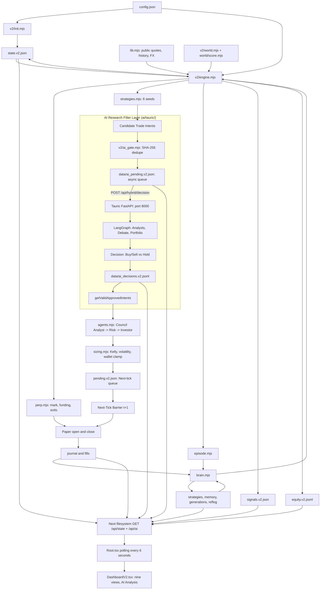

# 02 — A. SOURCE ARCHITECTURE

This file reconstructs P1–P11. The separate [recommended architecture](19-recommended-architecture.md) does not supersede it automatically.

## Processes and component boundaries

`Journal → API` represents fills read from trades, not raw pre/post journal exposure. The route reads named v2 files directly; it does not invoke the engine or brain. The AI gate executes asynchronously and fail-closed: failures default to `AI_UNAVAILABLE` and do not block the 30-second engine cycle.

## System-level answers

| Concern | Source behavior |
|---|---|
| Trading engine | Loads state, gathers data, marks/manages positions, executes paper orders, evolves, persists |
| Dashboard | Observes equity, positions, episodes, strategies, world, memory, fills and generations |
| Communication | JSON/JSONL files under root `data/`; Next GET response; no socket or database |
| Market data | Parallel Yahoo quotes; Coinbase crypto fallback; Yahoo daily/intraday histories and FX |
| Signals | Deterministic seed functions over enriched quotes, ranked per free symbol |
| Strategy selection | Highest signal confidence × (0.5 + learned strategy confidence); non-retired market-compatible seeds |
| Position sizing | Learned strategy Kelly × account multiplier × equity × volatility multiplier × conditional goal multiplier; wallet cap |
| Leverage | Signal base leverage constrained by aggression and market caps; maintenance-tier helpers also exist |
| Liquidation | Compare EMA mark to simplified stored side-specific liquidation threshold before any other exit |
| Fees | Taker entry charge; every close charges fees; maker/legacy schedules exist but selection beyond taker unspecified |
| Funding | Crypto signed payments at crossed UTC 00:00/08:00/16:00; latest world funding rate |
| Slippage | Square-root participation proxy; adverse side-aware fill price including half-spread |
| Stops/targets/trail | Strategy price-distance metadata plus engine management; liquidation first, then stop, target, time, trail |
| Episodes | USD 100 to goal USD 500, zero-equity blowup or 24-hour limit; records then reset |
| Persistent learning | Strategies/memory/generations/reflog survive resets; aggression also survives |
| Performance | Pre/post journals paired by trade_id → realized R → stats, DSR, lifecycle, Kelly |
| Memory | Append text lessons; rank last 500 by importance × recency × regime relevance |
| Market context | Separate quote-based trading regime and macro/news-derived world regime; not interchangeable |
| Evolution | End-of-run and live cadence risk dials; generation increments on episode end |
| Trades | Fill events in trades.v2.jsonl; analysis context/result in journal.v2.jsonl |
| AI research filter | Embedded Tauric FastAPI (`POST /api/hybrid/decision`) evaluates proposed side; fail-closed |
| UI state | Route combines signals/state, AI queue/decisions, and histories; Root polls every six seconds |
| Continuous run | Engine loops every 30 seconds; Next dev process at port 3000; Tauric AI at port 8000 |

## Boundary distinctions that must remain visible

1. `walletBalance` is free collateral, not total equity. Open isolated margins are separate.
2. Last observed price, adverse fill, EMA mark and liquidation threshold are different quantities. P8/P2 leave entryMark-versus-fill wiring ambiguous.
3. Current-run equity resets. Lifetime learning and previous run records do not.
4. `regime` from lib can be `mixed_chop` or `crypto_down`; world regime uses `risk_on/risk_off/neutral`. P3 initializes `lastWorldRegime` to `neutral` while trading regime is `mixed_chop`.
5. A generated intent is not a fill. The source's next-tick promise conflicts with cycle step 6; implementation must resolve this explicitly.
6. `collectWorldV2` in brain is a read-only passthrough; `collectWorld` from v2/world is the provider collector.
7. Root `PATHS` and `V2` paths coexist. Only v2 execution is wired by P8/P11.

## SOURCE DOES NOT SPECIFY

A market-data timestamp schema, transaction boundaries spanning files, execution deduplication, order acknowledgements, scheduler overlap prevention, pending-order reset behavior, persistent ORB observations, limit/maker orders, per-instrument funding history, non-crypto borrowing implementation, how riskState transitions occur, or a causal rule that converts lesson text/world sentiment into new entries.

## RECOMMENDED IMPROVEMENT

Keep these processes and file-backed boundaries. Complete the missing contracts rather than substituting a database, microservices, an LLM trader or real exchange integration. See decision register D01–D14 in [19](19-recommended-architecture.md).
