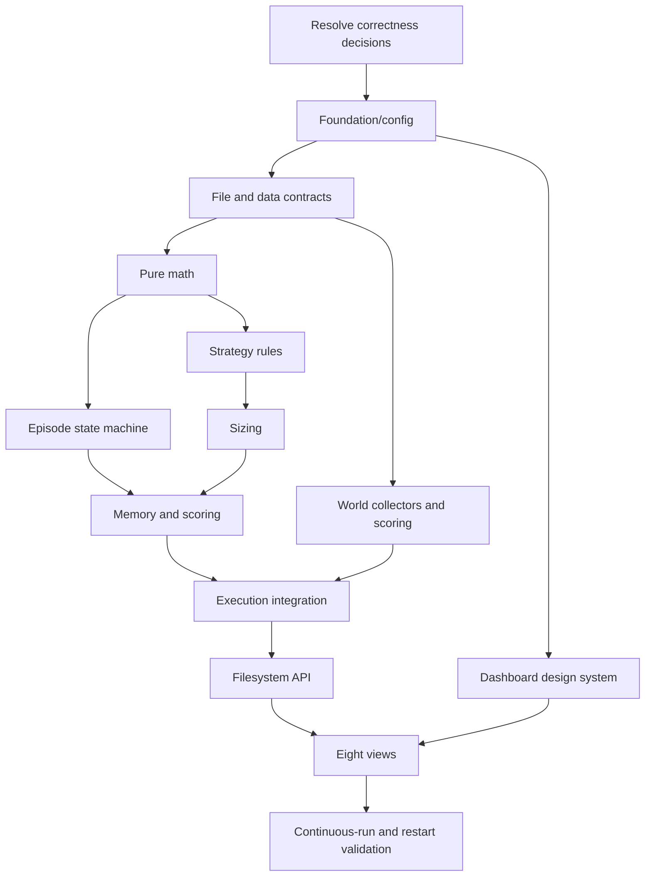

# 03 — Dependency-aware build order

SOURCE REQUIREMENT: P1–P11 establish the broad construction sequence. The acceptance gates and parallelization below are RECOMMENDED IMPROVEMENT. Do not interpret this blueprint as evidence any application stage already passes.

## Stage contracts

| Stage | Prerequisites | Build | Tests | Proof artifact |
|---|---|---|---|---|
| 0. Decisions | Read source/audit | Approve decisions on fills, accounting, statistical conventions, resets and schemas | Review against source labels; no silent override | Approved decision register, including rejected proposals |
| 1. Foundation | Node/dependency verification | P1 folders, ESM manifests, web app and exact config | Config semantic and source-payload comparison; web type/build smoke | Tree, manifest/lockfile review; config fixture |
| 2. Data layer | Foundation | lib/store paths, atomic JSON, bounded JSONL, timestamps, provider abstractions | Missing/corrupt/truncated files; path mapping; atomic-reader behavior | Passing file-contract tests and example synthetic schemas |
| 3. Financial/statistical math | Data contracts | perp primitives, indicators, stats, DSR helpers | Golden vectors, sign symmetry, finite inputs, tier/funding boundaries | Unit results with the source liquidation vectors |
| 4. Episode state machine | Math/state schema | Fresh state, drawdown, end precedence, final records, preservation/reset | Goal/time/blowup overlap; survivors; repeated completion | Before/after fixtures proving preserved learning |
| 5. Strategy rules | Indicators/quotes/session contracts | Six seeds, no-clobber registration, entries/exits/arbitration/cooldown | Exact thresholds, insufficient closes, channel exclusion, late ORB | Deterministic rule fixtures with timestamped signals |
| 6. Risk/sizing | Strategy orders, state and volatility | Exact sizeOrder plus approved guards | Explicit/default margin, all markets, near goal, underwater, multiple queued orders | Hand-calculated sizing vectors and budget invariants |
| 7. Memory/brain | Journals/episode/strategy contracts | Join trades, score/gate, Kelly, lessons, hash records, evolution/digest | Small samples, DSR, missing pre, probation, repeated cadence | Reproducible strategy/generation/lesson fixtures |
| 8. World model | Network/file layer; can run parallel to 4–7 | Nine provider groups, scoring, independent TTL caches | Missing/stale/malformed feeds, funding units, mixed news | Timestamped provider fixtures with explicit missing/stale status |
| 9. Execution engine | Stages 2–8 | Ordered cycle, pending barrier, accounting, state/signals publication | Entry/exit costs, liquidation, multi-order budget, reset and crash replay | Deterministic end-to-end ledger reconciliation |
| 10. API/data bridge | Published fixture set | Dynamic GET route, defaults, bounded histories | Missing files, malformed files, fallback version, timestamp serialization | Valid response consumed without engine imports |
| 11. Dashboard | API and visual scaffold | Eight views, exact copy, responsive panels | View fixtures, polling, empty/error/stale, mobile overflow | Type/build results and screenshot review |
| 12. Continuous integration | All prior stages | CLI startup, restart, provider smoke and long-run checks | Forced interruption, late funding, session rollover, no future-data fills | Restart replay equality and paper-only acceptance report |

## Blocking acceptance rules — RECOMMENDED IMPROVEMENT

- A pretty dashboard is not evidence of financial correctness.
- Do not enable simulated fills until costs, quote age, next-tick semantics and trade idempotency have deterministic tests.
- Do not promote a strategy using fabricated trades or a made-up backtest prior.
- Build world collectors and visual design independently, but integrate only against agreed schemas.
- Test malformed and missing observations without requiring unreliable public APIs on every test run; keep live smoke tests separate.
- No claims of passing tests, package availability or feed availability until observed and recorded.
