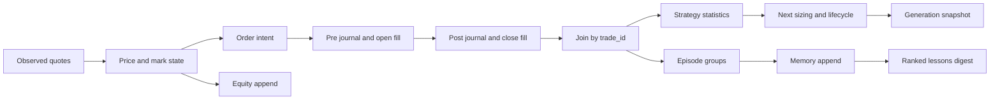

# 06 — Data architecture

## SOURCE REQUIREMENT — storage model (P2–P9)

Root `DATA = ROOT/data`; ROOT is the parent of scripts. JSON snapshots use two-space pretty printing and `.tmp` then rename. `readJSON(path,fallback=null)` supplies a missing-file fallback; treatment of malformed files is not explicitly defined. `appendJSONL` appends one record; `readJSONL(path,limit=0)` keeps the last N lines when limited. `log(msg)` exists; exact formatting/rotation unspecified.

### Complete V2 registry and lifecycle

All paths below are inside DATA. E = episode transition; G = generation increment. There is **no separately specified generation-reset operation**. “Preserve” means P3's learning-preservation invariant or continued history, not proof of crash-safe transactions. Full retention/compaction policy is unspecified for every history.

| V2 key → filename | Owner / writer | Readers | Shape and lifecycle |
|---|---|---|---|
| state → `state.v2.json` | init/engine; episode/brain mutate caller state | engine, init, API | Current state object; rewritten snapshot; E resets selected fields; G updates generation, not full reset |
| signals → `signals.v2.json` or env `FAB_SIGNALS` | engine publishSignals | API (hardcoded names), external consumers unspecified | Published snapshot; rewrite; E/G replace with latest view; override path resolution unspecified |
| episodes → `episodes.jsonl` | episode.finalizeEpisode | engine/brain/API | Finished-run records; append; preserve E/G |
| generations → `generations.jsonl` | brain.onEpisodeEnd | brain/API | Generation snapshots + note; append; preserve E/G |
| strategies → `strategies.json` | ensureStrategies/scoreStrategies | sizing/dispatcher/brain/API | Object with strategies array; merge/update, preserve learned stats E/G |
| memory → `memory.jsonl` | brain.addMemory/distillEpisodeLessons | retrieveLessons/API | Lesson records; append; preserve E/G |
| pending → `pending.v2.json` | init empties; engine consumes; dispatcher integration unresolved | engine | Pending order queue; JSON container shape unspecified; E/G clearing unspecified; operational, not learning |
| backtestStats → `backtest_stats.json` | SOURCE DOES NOT SPECIFY producer | Possible prior integration not wired | Schema/retention/reset/append semantics unspecified; do not fabricate backtest results |
| trades → `trades.v2.jsonl` | engine execution | API | Open/close fill events; append; preserve E/G |
| equity → `equity.v2.jsonl` | engine | API | Equity observations per cycle; append; preserve E/G; episode segmentation fields unspecified |
| prices → `prices.v2.json` | engine | API does not directly list it; engine caches as implemented | Quote snapshot; rewrite; E/G policy not specified; no invented history storage |
| log → `engine.v2.log` | engine/store log integration | operator | Diagnostic text, exact schema/rotation unspecified; append behavior expected from logging but not expressly defined; E/G policy unspecified |
| journal → `journal.v2.jsonl` | engine pre/post execution | brain.loadClosedV2 | Trade context/result rows; append; preserve E/G |
| playbook → `playbook.json` | SOURCE DOES NOT SPECIFY | No concrete later reader | Reserved path only; schema/lifecycle unspecified |
| reflog → `reflog.v2.jsonl` | brain lifecycle/evolution | Reader not named | Hash-chained change records; append; preserve E/G; canonical serialization unspecified |
| calib → `calibration.json` | SOURCE DOES NOT SPECIFY | No concrete later reader | Reserved path only; schema/lifecycle unspecified |
| world → `world.v2.json` | collectWorld | brain.collectWorldV2, engine publication | World snapshot/digest; rewrite; preserve last-good observations across runs conceptually; reset behavior unspecified |
| worldThesis → `world_thesis.v2.json` | SOURCE DOES NOT SPECIFY | No concrete later reader | Reserved thesis path; generation/format/reset unspecified |
| worldCache → `world_cache_v2/` | world collector | world collector | Per-source last-good cache, TTL 5–60 minutes; child filenames and schemas unspecified; disposable cache, but no reset command specified |
| aiPending → `ai_pending.v2.json` | ai_gate.enqueueCandidate / drain | engine / API | Active asynchronous queue holding requests (`pending`, `approved`, `rejected`, `expired`, `failed`, `consumed`); rewritten snapshot |
| aiDecisions → `ai_decisions.v2.jsonl` | ai_gate.recordDecision | API / UI | Immutable historical audit ledger of all AI research deliberations and verdicts; append |
| heartbeat → `heartbeat.v2.json` | engine cycle | API / monitor | Periodic engine process liveness and cycle heartbeat (`ts`, `pid`, `cycle`, `snapshotId`); rewrite |

Additional root PATHS keys: `config,state,signals,prices,trades,equity,journal,playbook,log`. P2 does not enumerate their filenames except root `config.json`; P9 explicitly introduces fallback `data/signals.json`, usable only when its `version` is 2. Do not infer a complete legacy data-file tree from these key names. `.tmp` artifacts are temporary write intermediates, not authoritative snapshots. In-memory daily/intraday histories, opening range and cooldown state have no mandated persistent filenames.

## State schema — P3

| Fields | Source type/initialization |
|---|---|
| version, episodeNum, episodeId | 2, 1, `ep_` + current time + `_1` |
| startedAt, updatedAt | now() numeric epoch milliseconds |
| startingCapital, walletBalance, equity, peakEquity | cfg.v2.startingCapital (100) |
| maxDrawdownPct, realizedPnlEpisode | 0 |
| positions | Map keyed by symbol, initially {} |
| riskState, regime, generation | `normal`, `mixed_chop`, 1 |
| aggression | kellyFraction=.45, leverageCap=20, leverageCeiling=40, unlockedLevel=0 from config |
| goal | target=500, deadlineHours=24, startEquity=100, startedAt=now |
| importanceAccum, closesSinceDeep, lastDeepReflectTs, cycles | 0 |
| blownUp | false |
| lifetime | episodes=1, totalBlowups=0, bestEpisodeReturnPct=0, bestEquityEver=100, careerStartedAt=now |
| lastWorldDeepTs, lastWorldRegime | 0, `neutral` |

P7 later adds `fundingRate`; P8 needs marks, funding timestamps and enriched quotes. Further state fields for cycles/sessions/cooldowns are not specified. `positions` remains a map internally; published positions is an array.

## Position and mark contracts — P2/P8

`openPosition({symbol,market,side,entryMark,margin,leverage,tiers,meta})` returns a position carrying identity/side/leverage and `entryPrice=entryMark`, `qty`, `notional`, `isolatedMargin=margin`, `mmr`, `maintDeduction`, `liqPrice`, `bankruptcyPrice`, `fundingAccrued=0`, `feesPaid=0`, `realizedPnl=0`, `peakUPnl=0`, `openedAt=now`, `lastFundingTs=now`, `openMeta=meta`.

`markPosition(pos,mark)` returns `{mark,uPnl,equity,maintMargin,liquidated}`. Which notional is used for maintenance (entry or current mark) is not explicit. Metadata must support strategy_id/setup_tag/stopPct/targetPct/reason downstream, but exact nesting and trade_id placement are not supplied.

## Orders and signals

P4 open intent: `{op:"open",symbol,side,leverage,strategy_id,setup_tag,stopPct,targetPct,confidence,reason,trade_id,sizePct:null}`. P5 adds/replaces `marginUsd` and leverage. Non-open orders pass through sizing unchanged. Close order schema, creation time, sequence, expiry, status and deduplication fields: SOURCE DOES NOT SPECIFY.

Each individual strategy returns `{side,baseLev,stopPct,targetPct,confidence,reason}` or null. Enriched quotes include `price`, daily `closes`, indicators and crypto `closesIntraday`; quote contract and publication schema are in [15](15-api-contract.md).

## Journal / fill / episode / learning records

- Journal P6: distinguish `pre` and `post`, paired by `trade_id`; actual discriminator key is unspecified. Pre must supply entry context. Post supplies `net_pnl`, `realized_R`, close metadata. Joined closed trade fields are exactly `trade_id,symbol,market,strategy_id,setup_tag,regime,side,exit_reason,net_pnl,realized_R,roi_on_margin,ts_close,hold_secs`. Attribution should be entry-time context, but source does not explicitly freeze it.
- Fill P8/P10: open/close, LONG/SHORT, symbol, leverage, reason; open margin, close realized profit. Field spellings except referenced shared identifiers are not fully specified. Separate fills from analytical journal rows; do not count opens as closed trades.
- Episode P3: `{episodeNum,episodeId,startedAt,endedAt,durationHours,startingCapital,finalEquity,peakEquity,returnPct,maxDrawdownPct,blownUp,endReason,generation,...extra}`. `extra` can override earlier properties under literal spread ordering; recommended reserved-key rejection is not source behavior.
- Strategy: exact seeds in 09 plus `n=0,expectancy_R=0,win_rate=0,kelly=.12,confidence=.2`. P6 later needs stats, lifecycle and optional `backtest_kelly`/failed-backtest information. Naming of all computed fields and failed-backtest flag is unspecified.
- Memory: title, kind, lesson text, regime and importance are needed by P10; a timestamp is needed by recency. Exact text/timestamp/group field keys and ID schema unspecified. Kinds include blowup/loss/win; no-trades note kind unspecified.
- Generation: generation, completed run context, leverage, Kelly, note needed by P10; exact schema unspecified.
- Reflection: hash-chained lifecycle/level changes; previous-hash field, canonical payload, initial hash and event key names unspecified.
- Equity: needs time/equity for graph; complete schema unspecified. Retaining old runs without episode tags would misrepresent reset jumps.

## Data flows

## RECOMMENDED IMPROVEMENT — completed storage contract

Use one engine writer, explicit schema versions, immutable event IDs, UTC timestamps, instrument currency/unit metadata and finite numeric validation. Publish a coherent snapshot ID last. Preserve malformed source files for diagnosis instead of replacing account state with fresh money. Make episode completion and queue consumption replay-safe. Do not present these additions as author-provided schemas. Per-file rename does not make several files one transaction; [19](19-recommended-architecture.md) defines the proposed file-backed recovery approach.
