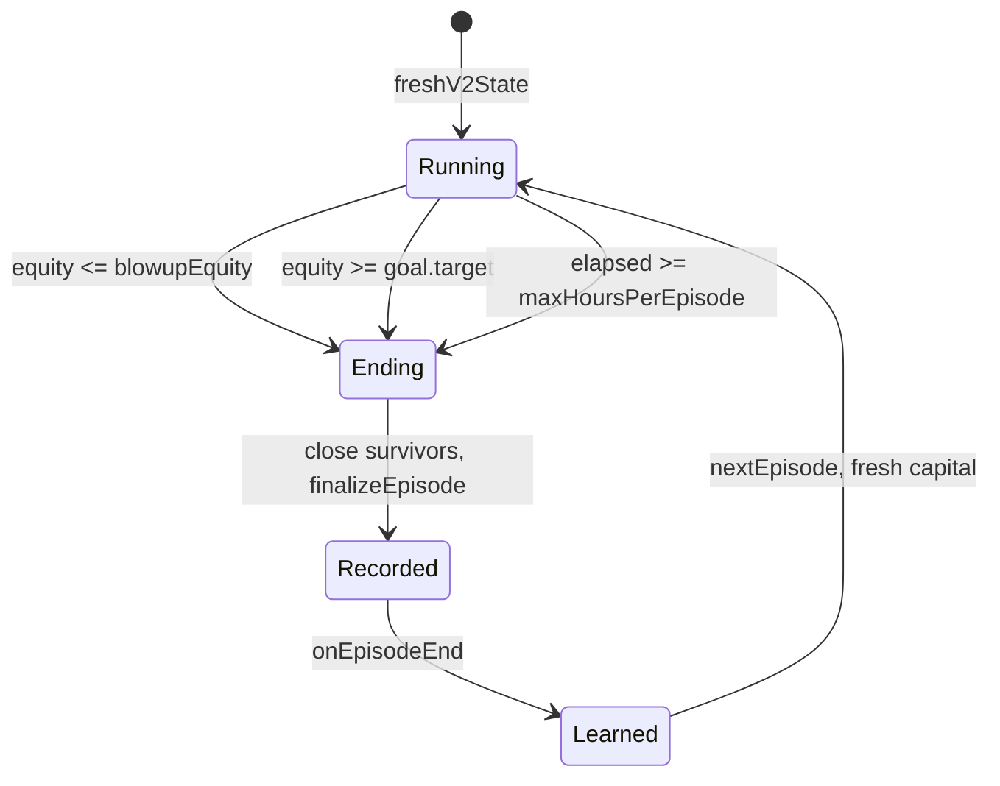

# 11 — Episodes and evolution

## SOURCE REQUIREMENT — episode state machine (P3/P8)

Check reasons in **blowup, goal, time** order, returning `blowup`, `goal`, `time`, or null. Initial equity 100; blowup threshold 0; goal 500; timeout 24 hours from episode startedAt. `setGoal` replaces goal using current equity as startEquity and fresh time; it does not explicitly change the episode's start/time limit. UI deadline and episode timeout are different fields.

`recordEquityPeak`: raise peak if equity improves, calculate current drawdown percent, retain maximum drawdown and lifetime.bestEquityEver; return current drawdown. `finalizeEpisode` computes return percent and duration, appends the record in 06, updates blowup count/best return and returns it. `nextEpisode` increments run number and lifetime.episodes and gives new identity/capital; no learning files are erased.

## Reset and preservation matrix

| State/data | On nextEpisode | Generation behavior |
|---|---|---|
| episodeNum, episodeId, startedAt | Increment/new timestamp identity | Generation does not reset numbering |
| startingCapital, walletBalance, equity, peakEquity | Reset to cfg.v2.startingCapital | No independent generation reset specified |
| maxDrawdownPct, realizedPnlEpisode | Clear to zero | Per-run values |
| positions | Clear after survivor settlement | No independent clearing on a level change |
| riskState, blownUp | normal, false | No other generation rule specified |
| goal | Fresh target/deadline with startEquity=capital | setGoal can separately replace |
| lifetime.episodes | Increment | Preserve |
| lifetime.totalBlowups/bestEpisodeReturnPct/bestEquityEver/careerStartedAt | Preserve/update records | Preserve |
| generation, aggression | Explicitly preserve across reset | onEpisodeEnd increments generation before reset |
| strategies/memory/generations/episodes/trades/journal/reflog | Preserve accumulated learning/history | Append or update; never erase because a run lost |
| importanceAccum/closesSinceDeep/lastDeepReflectTs/cycles | SOURCE DOES NOT SPECIFY reset | Do not assume cleared |
| regime/updatedAt/lastWorldDeepTs/lastWorldRegime/fundingRate | SOURCE DOES NOT SPECIFY reset | Engine subsequent updates may refresh |
| pending queue, session/cooldown/history caches | SOURCE DOES NOT SPECIFY reset | Required decision to prevent prior-run intents entering next run |

Lifetime.episodes counts started runs; episodes.jsonl counts finished runs. Initial bestEpisodeReturnPct=0 means an all-losing career still reports zero as “best” under a literal max implementation; this is a source initialization weakness, not a real zero-return episode.

## SOURCE REQUIREMENT — onEpisodeEnd (P6)

Score strategies, distill this episode's lessons, compute edge=mean(closedThisEp realized_R). If hit goal, or timed out in profit, **and** edge>0: unlockedLevel+=1; kellyFraction+=.07×clamp(edge,.2,1.2). If blowup: unlockedLevel−=1; kellyFraction−=.03. Otherwise no end-of-run increase specified.

Then leverageCap=clamp(leverageStart+unlockedLevel×earnItUnlockStep,leverageStart,leverageCeiling); configured 20+3.5×level, bounded [20,40]. Increment generation; append generations.jsonl with a plain-English note and reflog change.

SOURCE DOES NOT SPECIFY unlockedLevel floor, final account-Kelly clamp, edge for no closes, or exact generation snapshot fields. Literal leverage lower bound is **starting leverage 20**, so a blowup at initial level cannot lower the cap below 20 even if level becomes negative. Seed leverage may remain 10–15, so raising a cap above 20 may not increase their actual leverage. Retuning account Kelly can still change size.

## SOURCE REQUIREMENT — evolveTick (P6/P8)

Called on eight-minute cadence. Needs ≥4 closed trades. Edge=mean(last 25 realized_R). If edge>.05 AND equity>run start AND drawdown<15: raise level and Kelly “a little.” If edge<−.05 OR drawdown≥18: lower them. Recompute cap using the same formula and reflog any level change. No generation increment is explicitly required here; do not invent one.

SOURCE DOES NOT SPECIFY increment/decrement amounts, trade lookback scope (career versus run), how fresh a qualifying sample must be, or whether unchanged four trades can trigger another level change every eight minutes. The 15 and 18 drawdowns are percentage points, unlike config ddCaution=.12/ddHalt=.20 fractions; resolve units explicitly.

## Learning versus evolution boundaries

Promotion/demotion/retirement are **strategy lifecycle** decisions described in 12. Episode/generation transitions are **account-level** decisions. A strategy can be re-scored after a trade closes without ending the episode. End-of-run aggression adjustment uses mean edge and profit/blowup conditions, not the full candidate-promotion gate; marketing “only after real proof” is stronger than the actual algorithm.

## RECOMMENDED IMPROVEMENT

Make episode ending idempotent, close positions exactly once, freeze the ending record before capital reset, cancel old-run intents, and tag every equity/trade record by run. Define finalEquity after all costs and maintain both terminal trigger and settled outcome when they disagree. Require newly closed trades for live level adjustments; record the last consumed trade/event ID. Explicitly clamp account Kelly to an approved lower bound and configured .7 ceiling. Do not choose live increments without approval. Revisit negative levels and the fixed 20× floor as a documented design decision, not a silent safety patch. A generation is a snapshot/event number, not a regenerated strategy population.
