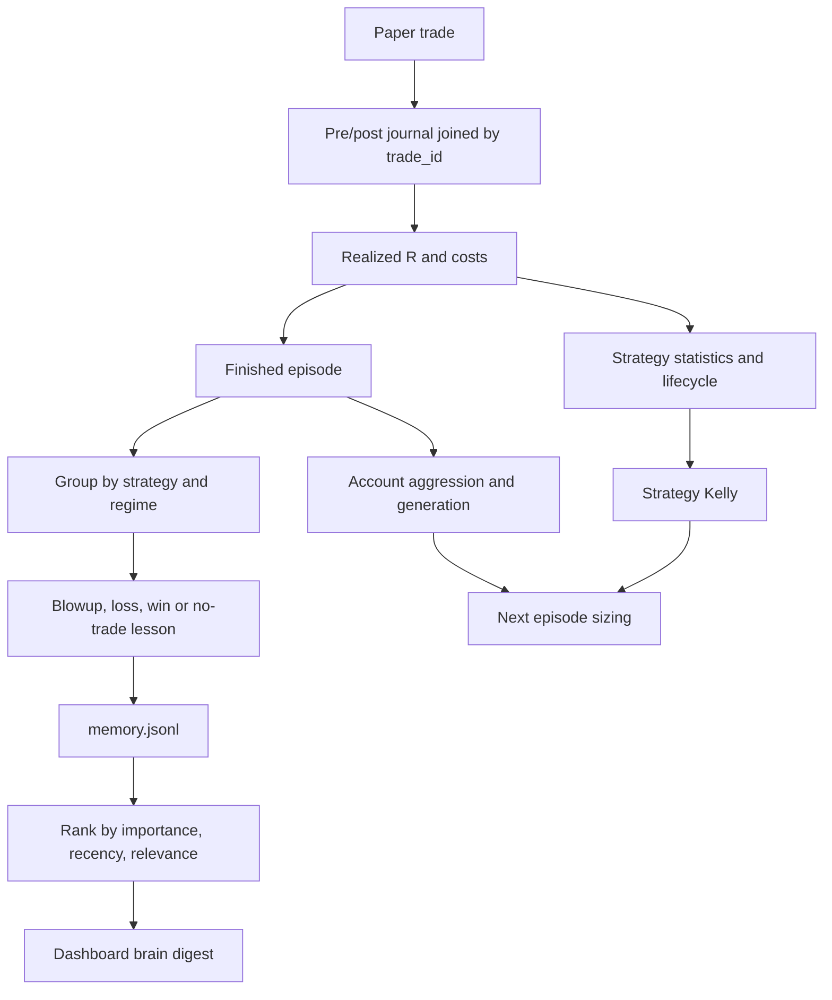

# 12 — Memory and learning

## SOURCE REQUIREMENT — P6 learning pipeline

This is a more faithful causal graph than a single chain implying that lesson text itself edits strategy statistics. The journal feeds statistics; memory text feeds retrieval/digest. SOURCE DOES NOT SPECIFY an automatic text-lesson-to-rule-edit mechanism.

## Closed trade collection

`loadClosedV2(sinceTs)` reads last 6,000 journal lines, pairs pre/post records by `trade_id`, returns exactly `trade_id,symbol,market,strategy_id,setup_tag,regime,side,exit_reason,net_pnl,realized_R,roi_on_margin,ts_close,hold_secs`. Filter semantics around sinceTs equality and whether pre rows before sinceTs remain available are not specified. Recommended: join first, filter by close timestamp afterward.

The source window is lines, not 6,000 completed trades; two-row trades yield at most approximately 3,000 pairs and fewer when unmatched/extra rows exist. A long-held position's pre can fall outside the window. Duplicate posts, missing pre, corrupted rows, partial closes and restart replay must not become fabricated closed trades.

## IMPORTANCE map — exact values

| Exit reason | Importance |
|---|---:|
| liquidation | 10 |
| capital-floor | 10 |
| stop-loss | 7 |
| episode-end | 6 |
| take-profit | 5 |
| trailing-stop | 4 |
| trend-flip | 3 |
| rsi2-reverted | 3 |
| manual-close | 3 |
| strategy-exit | 3 |
| default | 2 |

`onClose(state,pos,reasonTag)` accrues importance. SOURCE DOES NOT SPECIFY exact changes to closesSinceDeep, a deep-reflection threshold or a manual-close API. Time-stop is not explicitly in the map and therefore falls under default unless mapped by an approved decision. A named capital-floor importance does not implement the missing capital-floor rule.

## Strategy lifecycle

`scoreStrategies` gathers each strategy's realized R, computes expectancyStats and DSR with nTrials=number of strategies. For six seeds, tNeed=4.25. Promotion requires **all** of:

- candidate with n≥30;
- wilsonLb>breakevenWr;
- profitFactor≥1.5;
- sqn≥1.5;
- expectancyR>0;
- tStat>3+.25×(nTrials−1);
- deflatedSharpe.pass, using unrounded DSR>.95.

Active→probation if last-30 PF<1.2 OR recent expectancy<0 OR sqn<1.0. Whether sqn is recent or full-history in this clause is SOURCE DOES NOT SPECIFY. Probation→active if recent PF≥1.5 AND recent expectancy>0; else retire if it “keeps failing.” Number of failed checks/trades and retirement threshold are unspecified. Recovery does not explicitly reapply all initial promotion gates. No retired→candidate transition is supplied.

Set confidence and Kelly and write strategies.json. Every lifecycle change goes into hash-chained reflog.v2.jsonl. Confidence's equation, range mapping and rounding are unspecified; initial confidence .2 is explicit. Do not invent a confidence formula and call it source-exact.

## Strategy Kelly

Under five trades use .12, or .04 if failed backtest. Otherwise .4×clamp(expectancyR/variance,0,1.5). Blend with `backtest_kelly` using prior pseudo-count 15 when available. Halve probation, retired=.02, final clamp [.02,.40]. Source does not define failed-backtest field name, variance estimator or exact blend equation/branch ordering. No module actually produces the backtest prior. Missing prior means no fabricated backtest result.

Kelly feeds P5 sizing; account kellyFraction is a distinct multiplier changed by evolution. Candidate default bets exist before statistical proof. Neither Kelly nor statistical gates guarantee profitable trades or finite drawdown.

## Memory creation and retrieval

`addMemory` appends memory.jsonl. `distillEpisodeLessons(state,rec,closedThisEp)` groups trades by strategy AND regime:

- Blowup: heavy lesson, kind `blowup`, importance 10; name worst strategy/regime and a corrective.
- Worst losing group: `loss`, importance 7.
- Best winning group: `win`, importance 5.
- No trades: note suggesting broader gates.

SOURCE DOES NOT SPECIFY whether worst/best ranks total net P&L, average R or another metric, whether multiple lesson types coexist after one episode, templates, deduplication or exact schema keys. P10 requires title, lesson text, regime, importance and kind. Keep corrections explanatory; broadening gates is a lesson suggestion, not automatic permission to weaken rules.

`retrieveLessons(regime,k=4)`: read last 500 memories, score importance×.95^ageDays×(1 if same regime else .4), return top k. Timestamp key, age rounding, future-time handling and equal-score tie order are unspecified. Finite importance and timestamp validation are recommended. Short-lived cache retrieval is not long-term memory loss: historical rows remain in the file although retrieval only sees a window.

## Brain digest and world passthrough

`buildBrainV2(state,regimeStr)` produces generation, episode, regime, aggression, importance, lifetime, strategies list, active count, avoid list, retrieved lessons and recent generations. Exact property names for conceptual fields and avoid-list rule are unspecified. `collectWorldV2` reads world.v2.json; it does not collect external data or invoke a language model.

`onEpisodeEnd` runs scoring/distillation/account evolution and increments generation. `evolveTick` performs cadence adjustments without a specified generation increment. Full dial thresholds and reset policy are in 11.

## Research attribution

SOURCE explicitly invokes FinMem and ReasoningBank “ideas”: weighted importance/recency, persistent lessons, learning from wins and losses. The supplied copy does not provide paper identifiers, reproduce their experiments, embeddings, vector retrieval, multi-agent reasoning or an LLM memory architecture. TradingAgents is not mentioned. Do not claim faithful implementation of those papers or cite invented research evidence for seed profitability.

## RECOMMENDED IMPROVEMENT

Require frozen entry attribution, net-cost-aware realized_R and deduplicated closed trades. Persist enough context to join across bounded journal reads. Version strategy rules when changing parameters so old statistics are not silently reused for a different strategy. Specify confidence, retirement persistence, prior provenance, nTrials accounting across experiments and reproducible replay. Use fresh outcomes rather than repeated scoring of unchanged samples to unlock aggression. Treat statistical gates as evidence filters, not guarantees; see testing and audit.
