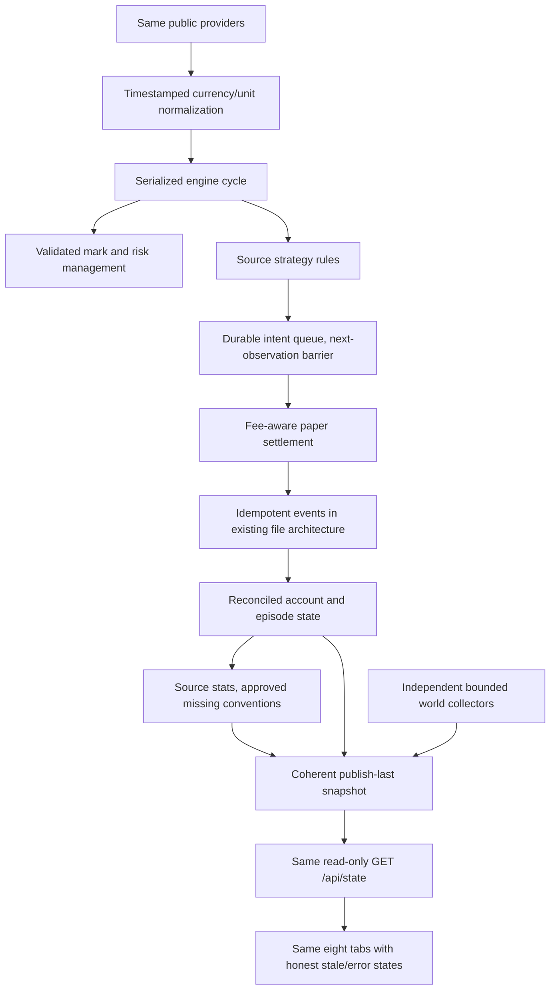

# 19 — B. RECOMMENDED ARCHITECTURE

Everything in this file is a **RECOMMENDED IMPROVEMENT**, not an extracted author requirement. User permission to apply architectural judgment does not make an invented threshold source-authoritative. No application implementation accompanies these proposals. A. SOURCE ARCHITECTURE remains in 02 and exact source configuration remains in 05.

## Preserve the original topology

Retain the built-in-only Node ESM engine, deterministic six seeds, file-backed persistence, episode/brain/world modules, Next read-only API and eight-tab sakura dashboard. Do not introduce a database, distributed service, runtime LLM, exchange credentials or real-money orders merely to solve local correctness problems.

New conceptual boxes are responsibilities, not invented source filenames.

## Required decision register

Status of every item: **proposed; not implemented**. “Open detail” identifies what still requires an explicit choice or empirical verification rather than pretending the article is complete.

| ID | Source issue | Recommended decision / open detail | Source difference |
|---|---|---|---|
| D01 | Same-cycle step6 vs next-tick promise | Strategy intents require an eligible observation later than creation; reserve capacity; manage risk exits separately; expiry/session rules documented | Changes literal P8 step6 to honor stated next-tick invariant |
| D02 | Incomplete ledger/fill/FX/funding | Executed price distinct from mark; USD-normalized ledger; costs exactly once; signed funding posted to one chosen location; fee-aware affordability; reconcile after every batch | Completes undefined accounting; historical/provider units still require verification |
| D03 | Indicators/retN/regimes | Use null insufficient SMA, Wilder RSI and percent momentum as proposed in08; explicitly choose literal versus intended retN index; approve deterministic regime coefficients/thresholds | Indicator choices are proposals; retN/regime details remain open until approved |
| D04 | Undefined risk controls | Validate all finite inputs; enforce market/tier/min-notional at fill; disclose stop-vs-liquidation distance; define root riskState/floor precedence | Adds guards absent from exact code; no silent config-number changes |
| D05 | Multiple-file crash consistency | Single writer; stable event/trade/episode IDs; durable operation identity; committed cycle metadata and publish-last snapshot; replay unapplied events | Adds recovery semantics without a database; exact commit record schema must be approved |
| D06 | Episode reset ambiguity | Settle survivors, record final cost-adjusted equity, finalize once, cancel previous-run intents, retain learning; keep trigger reason and outcome separate | Completes reset contract; no invented generation-reset operation |
| D07 | Statistical conventions incomplete | Freeze net-R denominator at entry; define variance/skew/kurt/PF-empty behavior; preserve exact DSR math; keep unrounded gate evidence | Requires approved conventions, no made-up backtest prior |
| D08 | Confidence/retirement/live dial unspecified | Require newly closed outcomes for each live adjustment; clamp account Kelly to approved minimum and .7 maximum; document confidence and retirement persistence functions | Exact live increments/retirement/confidence remain open rather than arbitrary defaults |
| D09 | Stale/missing data and FX83 | Add observation provenance; no fake neutral readings; block relevant new exposure when required quote/FX missing; optional world failures degrade independently | Rejecting literal FX83 fallback is an explicit source deviation |
| D10 | Funding average/interval/history | Verify provider units/asset mappings; charge only rates defined for boundary; record unpriced accrual explicitly if unavailable | Per-asset historical funding is a proposed correction, not source's average-rate mechanism |
| D11 | API/schema/override mismatch | Adopt15 completion contract, coherent snapshot metadata and shared FAB_SIGNALS resolver; finite JSON/null-unavailable policy | Adds fields/errors not named by source, retains endpoint/filesystem |
| D12 | Unbounded files and polling | Bounded JSONL tails/indexes, preserved closed-trade context, explicit retention; archive only with replayable references | Optional implementation optimization becomes necessary with growth |
| D13 | Command/dependency mismatch | Preserve exact source manifest in documentation; approve aliases to v2 CLI; verify current pinned packages/Node and record lockfile | Fixes nonexistent targets rather than silently inventing legacy engine |
| D14 | Visual certainty versus actual evidence | Keep source theme/copy, add concise proxy/stale/paper-only qualifications, empty/error states and accessibility; show cap separately from actual leverage | Labeled UI improvements, no cosmetic loss suppression |

## Proposed crash-recovery protocol

This is a design specification, not code. Before settlement, record a stable operation ID and the decision's input timestamps. Financial effects, fill/pre/post records and state reference that identity. On restart, recover only committed account transitions and replay or finish incomplete ones using the same ID; do not emit a second economic event. Mark queue consumption only as part of the same recoverable transition. Append episode completion once, then generation/lesson events with stable related IDs, then fresh episode state. Publish a snapshot only after its account transition is durable.

Atomic rename alone is insufficient; implementation must demonstrate the selected protocol with interruption after every write. A filesystem transaction manifest or replayable event stream is acceptable **only as a clearly approved additional artifact**, whose exact filename/schema is not supplied by the source. Do not claim this plan magically provides transactions without implementing and testing that protocol.

## Recommended implementation profiles

1. **Source-reference fixtures:** exact supplied equations, seed constants and sizing behavior. Used to detect accidental drift, not to claim source bugs are safe.
2. **Recommended runtime baseline:** approved guards/accounting/queue/recovery conventions with explicit deviations recorded. No silent dual-mode execution or additional config keys are mandated by this document.
3. **Optional later research:** conservative capital/leverage profile, venue-specific mark/liquidation, measured depth/slippage, independently designed backtest harness. None is necessary to reconstruct source and none should be mixed into source results.

## Approval and completion standard

An agent can implement fully specified modules immediately after contract approval, but must not invent the remaining empirical/numeric choices under source labels. Record each selected value with rationale/test oracle. Security is delegated to the Security Analyst Agent through the new Chat icon. Package/provider verification requires actual external checks. Release readiness depends on completed tests and explicit decisions, not on this document calling the architecture perfect.
