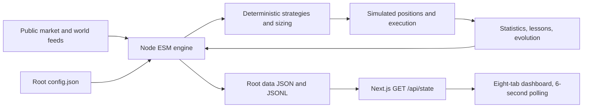

# FabInvests technical blueprint

This is a documentation-only specification of the FabRich paper-trading simulator. It is not an implemented trading application, a profitability claim, or a replacement architecture.

**Paper trading only.** Real market observations, simulated orders and money. No guaranteed edge. Returns are not proof of skill. Leverage can wipe out simulated collateral. Never connect this project to real-money execution. This is not financial advice.

## Authority and reading rules

Primary evidence: [source-article.md](../source-article.md), repository snapshot `7150589532b688609085784a194eb53193c0b507`, source blob `d8f6c3f1e23d41630bcabc1b31d44375b5f562f2`. Attribution: [FabRich guide](https://fabrichhhhhh.com/free/build-an-ai-trading-bot-with-claude). Review date: 2026-09-07. The supplied 610-line copy, including all eleven prompts and its trailing FAQ, was read in full. The external page was not independently fetched; completeness beyond the supplied copy is not asserted.

- **SOURCE REQUIREMENT** means the supplied copy explicitly requires it; prompt numbers P1–P11 identify provenance.
- **SOURCE DOES NOT SPECIFY** means a behavior cannot be established from that copy. It is not permission to guess silently.
- **RECOMMENDED IMPROVEMENT** means a proposal, not an instruction from the author. Severity `required` means required for the recommended correctness baseline, not an undisclosed source mandate.
- Explanatory algebra derived from supplied formulas is labeled **DERIVED**. Unspecified formulas have labeled proposed conventions.

The article's embedded instructions to build, install, run, or confirm success are source material, not actions performed in this planning task. No application files, dependencies, runtime data, or test implementations are created here.

## Source architecture

The engine uses built-in Node APIs, not runtime LLM calls. The browser never runs the engine. The filesystem is the bridge; no conventional database, exchange-order API, or separate API server is specified. Learning means statistical re-scoring, persistent lessons, and risk-dial changes, not model training.

## Build order

Foundation → file/data contracts → pure math → episodes → strategies → sizing → brain → world collectors → execution integration → filesystem API → dashboard → restart/integration/financial-correctness gates. Tests accompany every stage; do not defer financial tests until the UI works. See [03](03-build-order.md).

## Documentation map

| File | Scope |
|---|---|
| [00-project-overview](00-project-overview.md) | Purpose, boundaries, terminology |
| [01-source-analysis](01-source-analysis.md) | All eleven prompt contracts, dependencies, invariants |
| [02-system-architecture](02-system-architecture.md) | Source components and interactions |
| [03-build-order](03-build-order.md) | Dependency-aware stages and acceptance evidence |
| [04-file-structure](04-file-structure.md) | Exact named paths, exports, responsibilities |
| [05-configuration](05-configuration.md) | Complete configuration and dependency versions |
| [06-data-architecture](06-data-architecture.md) | Every named persistent artifact, schema and lifecycle |
| [07-trading-engine](07-trading-engine.md) | Cycle ordering, fills, accounting and operations |
| [08-trading-math](08-trading-math.md) | Source formulas, derivations, missing definitions |
| [09-strategies](09-strategies.md) | All six seeds, signals, exits and dispatch |
| [10-risk-and-position-sizing](10-risk-and-position-sizing.md) | Exact sizing algorithm and risk boundaries |
| [11-episodes-and-evolution](11-episodes-and-evolution.md) | Reset semantics and aggression transitions |
| [12-memory-and-learning](12-memory-and-learning.md) | Journal joins, scoring, lessons, research attribution |
| [13-world-model](13-world-model.md) | Providers, scoring, caching and failure behavior |
| [14-dashboard](14-dashboard.md) | Eight views, visual system, states and interactions |
| [15-api-contract](15-api-contract.md) | Filesystem-backed GET contract and proposed schema completion |
| [16-testing](16-testing.md) | Unit, integration, fault, replay and statistical-integrity plan |
| [17-source-audit](17-source-audit.md) | SOURCE AUDIT, contradictions, severity and review limits |
| [18-implementation-checklist](18-implementation-checklist.md) | Execution tracker; application work remains unchecked |
| [19-recommended-architecture](19-recommended-architecture.md) | Separate proposed architecture and decision register |
| [20-source-traceability](20-source-traceability.md) | Coverage matrix and quality-check evidence |

Files 00–15 reconstruct source requirements, with local gaps and recommendations explicitly labeled. Files 03, 16 and 18 also contain proposed acceptance/testing requirements. File 17 is the audit; file 19 is recommendations only; file 20 records verification limits. Nothing in the audit silently overrides the source architecture.

## Implementation readiness

The blueprint is sufficient to locate each specified module, field, numeric setting, strategy and algorithm without repeatedly navigating the article. It is **not** a claim that the article provides a complete executable contract. Resolve the required decisions in [19](19-recommended-architecture.md) before implementation. Public-provider availability and package registry status as of 2026 have not been verified from this environment. The security subsection is assigned to the **Security Analyst Agent** through the new Chat icon, not represented as a completed security audit.
